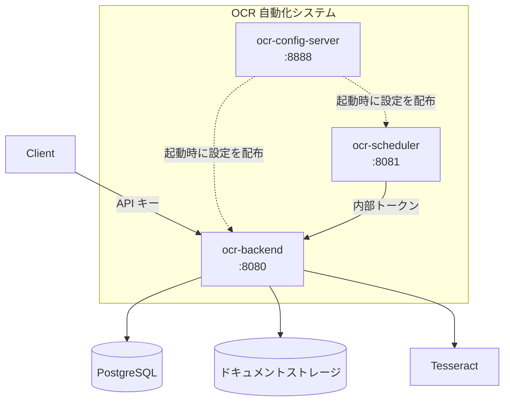
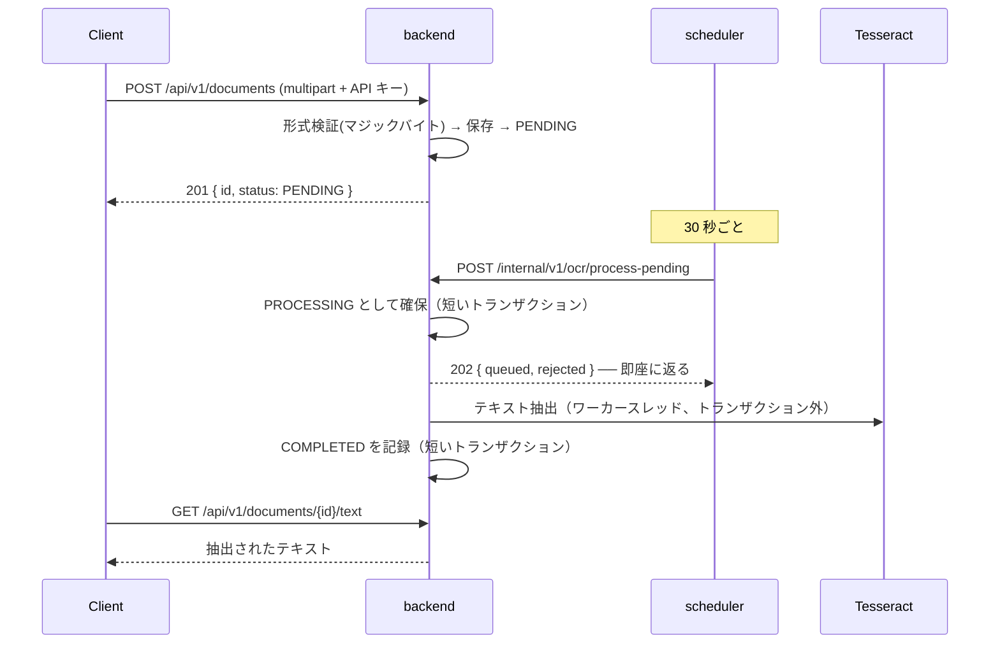

# OCR 自動化システム

[English](README.md) | [한국어](README.ko.md) | [简体中文](README.zh-CN.md) | **日本語**

> ドキュメントをアップロードすると OCR でテキストを抽出して保管するシステム。
> **Spring Boot + Tesseract + Spring Cloud Config** で構成した三つのサービス。

OCR は遅く、よく失敗し、エンジンが入れ替わる。この三つを前提に置いて、
**遅い処理がリクエストを塞がないように**、**失敗してもドキュメントが失われないように**、
**エンジンを差し替えてもビジネスロジックがそのままであるように**することが目標だ。

このリポジトリは**アンブレラリポジトリ**だ。実際のコードはサブモジュールで繋がった
各サービスのリポジトリにあり、ここにはシステム全体をどう組み合わせて動かすかが入っている。

<br>

## 🎯 設計目標

- **境界ごとに責任を一つずつ** — 設定は設定サーバーが、「いつ」はスケジューラが、「どう」は backend が
- **変わるものをポートで切る** — OCR エンジンとストレージはアダプタの差し替えで変わる
- **失敗を前提に設計する** — インスタンスが落ちてもドキュメントは回収され再処理される
- **誤って開くより誤って塞がる方がよい** — ルールにない経路は拒否する

<br>

## 🧩 構成

| サービス | ポート | 役割 | リポジトリ |
|---|---|---|---|
| **config.server** | 8888 | 中央設定管理 | [ai.ocr-automation.system-config.server](https://github.com/hyunolike/ai.ocr-automation.system-config.server) |
| **backend** | 8080 | ドキュメント API + OCR 処理 | [ai.ocr-automation.system-backend](https://github.com/hyunolike/ai.ocr-automation.system-backend) |
| **backend.scheduler** | 8081 | バッチジョブのトリガー | [ai.ocr-automation.system-backend.scheduler](https://github.com/hyunolike/ai.ocr-automation.system-backend.scheduler) |



### なぜこう分けたのか

| 境界 | 理由 |
|---|---|
| 設定をサービスの外へ | DB 接続情報がリポジトリごとに散らばらず、ジョブ周期を再デプロイなしで変えられる |
| スケジューラを backend の外へ | Tesseract のネイティブ依存を一箇所に集める。スループットが要るなら backend だけ増やす |
| OCR 実行は backend の中に | スケジューラは**「いつ」だけ**を知り、**「どう」は知らない**。エンジンを変えてもスケジューラはそのままだ |

<br>

## 🚀 機能要件

### ドキュメント処理

- 画像（PNG/JPEG/TIFF）または PDF をアップロードすると OCR 待ち行列に載る。
- ファイル形式は**ヘッダーではなく内容（マジックバイト）で判断する。**
- スケジューラが定期的に、待機ドキュメントを backend のワーカープールに**受け付け**させる。
- 処理に失敗すれば再試行し、上限を超えれば `FAILED` に確定する。
- インスタンスが落ちて `PROCESSING` に止まったドキュメントは回収して再処理する。

### 認証と分離

- 公開 API は **API キー**を要求する。キーが所有者を決める。
- すべての照会は所有者の範囲に絞られる。他人のドキュメントには **404** で応答する。
- サービス間呼び出し（`/internal`）は共有トークンで塞ぐ。
- 設定サーバーは基本認証で塞ぎ、値は `{cipher}` で暗号化できる。

<br>

## 🔄 ドキュメント 1 件の流れ



```
PENDING ──▶ PROCESSING ──▶ COMPLETED
   ▲             │
   │             └──▶ FAILED（再試行の上限を使い切った）
   └─────────────┘
     再試行の余裕が残っていれば戻る
```

<br>

## 📄 主な API

すべての公開 API は **API キー**を要求する（`X-API-Key` または `Authorization: Bearer`）。
キーが所有者を決め、リクエストのどこにも所有者を指定する場所はない。

| Method | Path | 説明 |
|---|---|---|
| `POST` | `/api/v1/documents` | ドキュメントのアップロード（multipart、フィールド名 `file`） |
| `GET` | `/api/v1/documents/{id}` | 状態・結果の要約 |
| `GET` | `/api/v1/documents?status=` | 一覧（状態フィルタ） |
| `GET` | `/api/v1/documents/{id}/text` | 抽出された全文 |

内部 API は共有トークン（`X-Internal-Token`）で守られている。
詳細は [backend README](https://github.com/hyunolike/ai.ocr-automation.system-backend#-インターフェース仕様) を参照。

<br>

## 📐 プログラミング要件

- 三つのサービスを Java 21、Spring Boot 3.5.16 で統一する。
- 各サービスは**独立したリポジトリ**で、このリポジトリがサブモジュールとして束ねる。
- 設定はすべて設定サーバーが配る。各サービスの `application.yml` には
  **「設定サーバーをどう見つけるか」だけ**を置く。
- スキーマの出所は **Flyway 一つ**だ。JPA は `validate` のみを行う。
- 起動順序は **設定サーバー → backend → scheduler** だ。
- **コミット単位は下の機能リスト単位とする。**

<br>

## ✅ 実装する機能リスト

### Phase 0 — 確認された欠陥

- [x] バッチが逐次処理でスケジューラのタイムアウトを超えていた
- [x] 自己呼び出しで `@Transactional` が適用されていなかった
- [x] 失敗したドキュメントを再アップロードしても再処理されなかった
- [x] コードが読まない死んだ設定キー

### Phase 1 — 運用投入を妨げるものの解消

- [x] 処理パイプラインの非同期化（有界キュー + バックプレッシャー）
- [x] ドキュメントへの所有者の導入（すべての公開照会に所有者条件）
- [x] 認証・認可（API キー / 内部トークン / 設定サーバーの基本認証）
- [x] アップロードファイルの内容検証（マジックバイト + PDF 検査）
- [x] 設定値の暗号化機能

### Phase 2 — デプロイ可能にする

- [ ] コンテナイメージ（tesseract は backend イメージにだけ）
- [ ] 全体の docker-compose 構成
- [ ] CI（ビルド・テスト、サブモジュール組み合わせの検証）
- [ ] 可観測性（待機件数、処理時間、キュー飽和、回収件数）
- [ ] OpenAPI ドキュメントの自動生成

### Phase 3 — 認識精度

- [ ] 画像前処理（解像度正規化・二値化・傾き補正）
- [ ] Tesseract の単語単位の信頼度収集
- [ ] `NEEDS_REVIEW` 状態 — 人が見るべきドキュメントを分ける
- [ ] PDF のページ単位処理

### Phase 4 — 規模

- [ ] S3 ストレージアダプタ
- [ ] ドキュメント保管期間ポリシーと整理バッチ
- [ ] メッセージキューへの移行判断

### Phase 5 — 構造化抽出

- [ ] ドキュメント種別の分類
- [ ] 抽出テキストから構造化フィールドを取り出す
- [ ] ビジョンモデルアダプタとの比較

<br>

## 📤 実行結果

> メッセージはサービスコードからそのまま出る韓国語だ。

### アップロード → 処理 → 照会

```bash
$ ./scripts/upload-sample.sh scan.png
▶ API 키 발급 (소유자: demo)
   ocrk_nRXV7l5...  (평문은 발급 응답에서만 볼 수 있다)

▶ 업로드: scan.png
{"id":"a1964f60-...","status":"PENDING","ocrResult":null}

▶ OCR 처리 접수
{"queued":1,"rejected":0,"skipped":0}

▶ 상태
{"id":"a1964f60-...","status":"COMPLETED","ocrResult":{"engine":"stub","textLength":85,...}}

▶ 추출 텍스트
[stub-ocr] 실제 인식이 수행되지 않았습니다.
```

### スケジューラが自動で拾う

アップロードして待つだけでよい。手動の呼び出しは要らない。

```
INFO c.o.a.s.job.PendingDocumentDispatchJob : 대기 문서 접수 완료: queued=1, skipped=0
```

### 所有者の分離

```bash
$ curl -H "X-API-Key: $BOB_KEY" .../documents/$ALICE_DOC
{"code":"DOCUMENT_NOT_FOUND","message":"문서를 찾을 수 없습니다: e04fb648-..."}
```

同じファイルを二人の所有者がアップロードすると**それぞれ別のドキュメント**になる。
グローバルなチェックサムだと他人のドキュメント ID が返ってくる。

### 形式を偽装したアップロード

```bash
$ curl -H "X-API-Key: $KEY" -F "file=@evil.png;type=image/png" .../documents
{"code":"CONTENT_MISMATCH","message":"파일 내용이 image/png 형식이 아닙니다"}
```

<br>

## 🛠 技術スタック

| 領域 | 技術 |
|---|---|
| 言語 | Java 21 |
| フレームワーク | Spring Boot 3.5.16 |
| 設定管理 | Spring Cloud Config (2025.0.3) |
| 認証 | Spring Security（API キー / 共有トークン / 基本認証） |
| 永続化 | Spring Data JPA、PostgreSQL 16 / H2 |
| マイグレーション | Flyway |
| OCR | Tesseract (tess4j 5.20.0) |
| PDF 検査 | Apache PDFBox |
| ビルド | Gradle 8.14.3 |

<br>

## 🏃 実行方法

### 1. リポジトリの取得

サブモジュールまで一緒に取得しなければならない。

```bash
git clone --recurse-submodules https://github.com/hyunolike/ai.ocr-automation.system.git
cd ai.ocr-automation.system

# すでに取得済みなら
git submodule update --init --recursive
```

### 2. 実行

**起動順序が重要だ。** backend と scheduler は設定サーバーから設定を受け取らないと起動しない。

```bash
# （任意）本番プロファイルで回すときだけ必要。local プロファイルは H2 を使う
docker compose up -d postgres

# ターミナル 1 — 設定サーバー
cd config.server && ./gradlew bootRun

# ターミナル 2 — バックエンド
cd backend && ./gradlew bootRun

# ターミナル 3 — スケジューラ
cd backend.scheduler && ./gradlew bootRun
```

既定プロファイルは `local` だ。**H2 インメモリ + stub OCR エンジン**で起動するので、
PostgreSQL も Tesseract もなしにパイプライン全体を動かせる。

### 3. 動作確認

```bash
# API キーがなければ内部経路で一つ発行して進める
./scripts/upload-sample.sh path/to/scan.png

# 所有者を変えて分離を確認できる
OWNER_ID=alice ./scripts/upload-sample.sh path/to/scan.png
```

### プロファイル

| プロファイル | DB | OCR エンジン | 用途 |
|---|---|---|---|
| `local`（既定） | H2（PostgreSQL モード） | `stub` | 外部依存なしでパイプラインを確認 |
| `default` | PostgreSQL | `tesseract` | 本番 |

スキーマの出所は両プロファイルとも **Flyway 一つ**だ。JPA は `validate` のみなので、
エンティティとマイグレーションがずれると起動段階ですぐ露見する。

<br>

## 📁 リポジトリ構成

```
ai.ocr-automation.system/          # このリポジトリ（アンブレラ）
├── config.server/                 # サブモジュール
├── backend/                       # サブモジュール
├── backend.scheduler/             # サブモジュール
├── docs/
│   ├── ARCHITECTURE.md            # 境界を分けた理由、状態マシン、トランザクション戦略
│   └── ROADMAP.md                 # これからの設計、やらないと決めたこと
├── docker-compose.yml             # ローカル PostgreSQL
└── scripts/upload-sample.sh       # 動作確認スクリプト
```

サブモジュールを最新に合わせるには:

```bash
git submodule update --remote --merge
```

<br>

## 🤔 設計で悩んだ点

| テーマ | 選択 | 理由 |
|---|---|---|
| サービス分割 | 設定 / 処理 / スケジュールの三つ | Tesseract 依存を一箇所に集め、スループットが要るときは backend だけ増やす |
| リポジトリ構成 | 独立リポジトリ + サブモジュール | サービスごとにデプロイ周期が違う。アンブレラが組み合わせを固定する |
| 処理方式 | 同期処理ではなく受け付け + ワーカープール | `バッチサイズ × 1 件あたりの所要` が呼び出し側のタイムアウトを超える |
| 作業の消失 | インメモリキュー + 滞留回収 | 落ちてもドキュメントは `PROCESSING` なので回収ジョブが拾う。ブローカーを増やさなかった |
| エンジンとストレージ | ポートで切る | 初期構造で最も確かなのは、あとで変わるという事実だ |
| 認証手段 | 経路ごとに別々に | 外部クライアント・サービス間・運用は性格が違う。一つにまとめるとどの層もまともにならない |
| 所有者 | `owner_id` 一つで始める | `tenant_id` の追加はマイグレーション一つだが、不要なテナント概念を剥がすのは難しい |
| 分散ロック | 保留 | 非同期受け付け以降、重複呼び出しのコストがほぼ消えた。前の段階が後の段階の必要をなくした |
| 開発既定値 | 名前自体を警告に | 見える危険と見えない摩擦のうち、前者を選んだ |

<br>

## ⚠️ 既知の簡略化

Phase 1 まで終わった状態だ。パイプラインは最後まで動き、認証・分離・検証も入ったが、
実運用の前に解消すべきものが残っている。

- **HTTPS がない** — API キーと内部トークンが平文で流れる。
- **開発用の既定資格情報がある** — 使われると起動警告が出るが、本番で環境変数を指定しなければ保護がない。
- **運用者権限がサービス間トークンと同じ** — スケジューラが使うトークンで API キーも発行できる。
- **コンテナイメージがない** — 各サービスに Dockerfile と CI が必要だ。
- **可観測性がない** — 処理が滞っているかをログでしか知れない。
- **OCR の信頼度を収集しない** — 結果を信じてよいか判断する根拠がない。
- **ローカルファイルシステムのストレージ** — backend を多重化するとファイルを共有できない。
- **元のドキュメントを整理しない** — 保管期間ポリシーがない。

サービスごとの限界は各リポジトリ README の「既知の簡略化」節にまとめてある。

<br>

## 📚 ドキュメント

- [docs/ARCHITECTURE.md](docs/ARCHITECTURE.md) — 境界を分けた理由、ポート/アダプタ、状態マシン、トランザクション戦略、認証
- [docs/ROADMAP.md](docs/ROADMAP.md) — 段階別の設計、実際にやったこと、**やらないと決めたこと**
- 各サービスの README — サービスごとの詳細設計と限界

<br>

## 🗺 今後実装するもの

**次は Phase 2 — デプロイ可能にする**だ。コンテナイメージと CI がなく、まだサーバーに載せられない。

- [ ] Dockerfile + 全体の docker-compose 構成
- [ ] CI（ビルド・テストの自動化、サブモジュール組み合わせの検証）
- [ ] 可観測性 — 待機件数、処理時間、キュー飽和、回収件数
- [ ] OpenAPI ドキュメントの自動生成
- [ ] HTTPS 終端と運用者権限の分離
- [ ] 画像前処理と信頼度ベースの `NEEDS_REVIEW`
- [ ] S3 ストレージアダプタ
- [ ] ドキュメント保管期間ポリシーと整理バッチ
