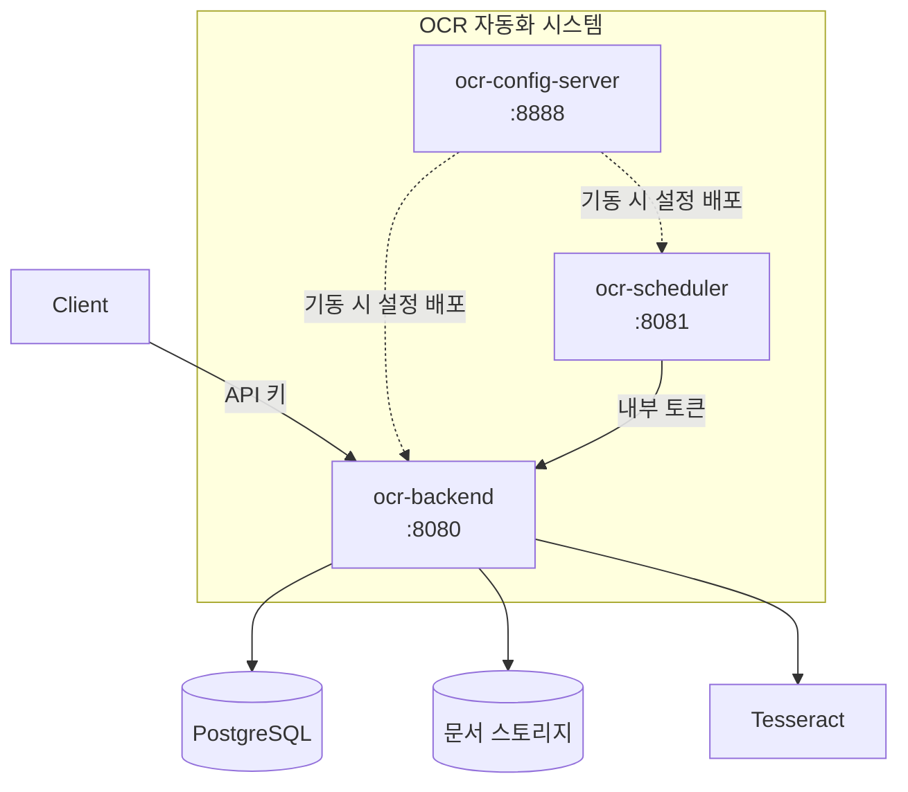
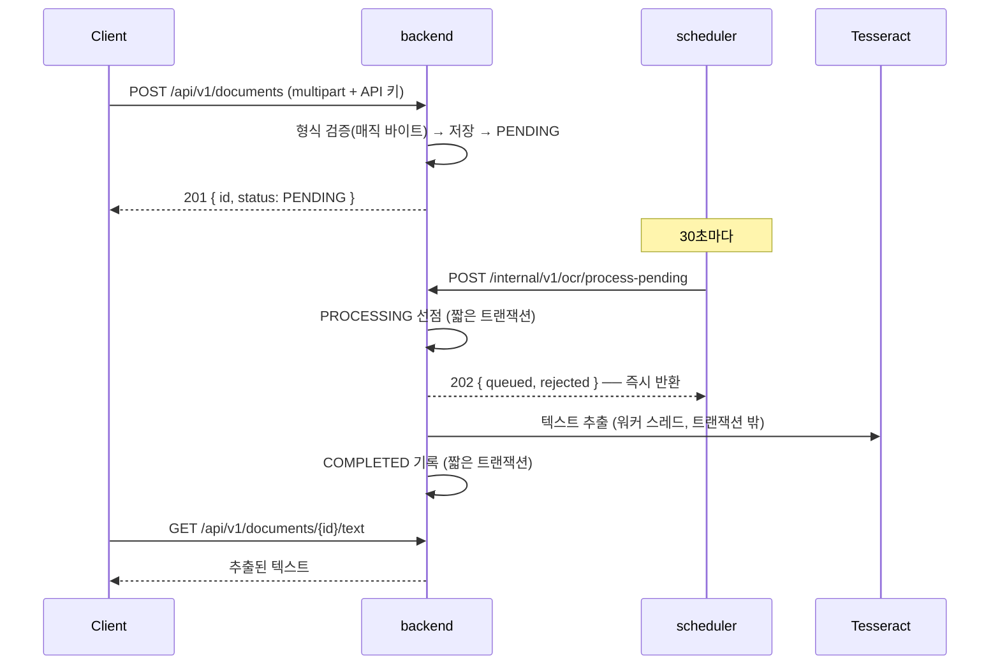

# OCR 자동화 시스템

[English](README.md) | **한국어** | [简体中文](README.zh-CN.md) | [日本語](README.ja.md)

> 문서를 올리면 OCR로 텍스트를 뽑아 보관하는 시스템.
> **Spring Boot + Tesseract + Spring Cloud Config**로 구성한 세 개의 서비스.

OCR은 느리고, 자주 실패하고, 엔진이 바뀐다. 이 세 가지를 전제로 두고
**느린 작업이 요청을 붙잡지 않게**, **실패해도 문서가 유실되지 않게**,
**엔진을 갈아끼워도 비즈니스 로직이 그대로이게** 만드는 것이 목표다.

이 저장소는 **엄브렐라 저장소**다. 실제 코드는 서브모듈로 연결된 서비스 저장소에 있고,
여기에는 시스템 전체를 어떻게 맞춰 돌리는지가 들어 있다.

<br>

## 🎯 설계 목표

- **경계마다 책임을 하나씩** — 설정은 설정 서버가, "언제"는 스케줄러가, "어떻게"는 backend가
- **바뀔 것을 포트로 끊는다** — OCR 엔진과 스토리지는 어댑터 교체로 바뀐다
- **실패를 전제로 설계한다** — 인스턴스가 죽어도 문서는 회수되어 다시 처리된다
- **실수로 열리는 것보다 실수로 막히는 편이 낫다** — 규칙에 없는 경로는 거절한다

<br>

## 🧩 구성

| 서비스 | 포트 | 역할 | 저장소 |
|---|---|---|---|
| **config.server** | 8888 | 중앙 설정 관리 | [ai.ocr-automation.system-config.server](https://github.com/hyunolike/ai.ocr-automation.system-config.server) |
| **backend** | 8080 | 문서 API + OCR 처리 | [ai.ocr-automation.system-backend](https://github.com/hyunolike/ai.ocr-automation.system-backend) |
| **backend.scheduler** | 8081 | 배치 잡 트리거 | [ai.ocr-automation.system-backend.scheduler](https://github.com/hyunolike/ai.ocr-automation.system-backend.scheduler) |



### 왜 이렇게 나눴나

| 경계 | 이유 |
|---|---|
| 설정을 서비스 밖으로 | DB 접속 정보가 저장소마다 흩어지지 않고, 잡 주기를 재배포 없이 바꾼다 |
| 스케줄러를 backend 밖으로 | Tesseract 네이티브 의존성을 backend 한곳에만 둔다. 처리량이 필요하면 backend만 늘린다 |
| OCR 실행은 backend 안에 | 스케줄러는 **"언제"만** 알고 **"어떻게"는 모른다**. 엔진을 바꿔도 스케줄러는 그대로다 |

<br>

## 🚀 기능 요구사항

### 문서 처리

- 이미지(PNG/JPEG/TIFF) 또는 PDF를 올리면 OCR 대기열에 오른다.
- 파일 형식은 **헤더가 아니라 내용(매직 바이트)으로 판단한다.**
- 스케줄러가 주기적으로 대기 문서를 backend 워커 풀에 **접수**시킨다.
- 처리에 실패하면 재시도하고, 한도를 넘기면 `FAILED`로 확정한다.
- 처리 도중 인스턴스가 죽어 `PROCESSING`에 멈춘 문서는 회수해 다시 처리한다.

### 인증과 격리

- 공개 API는 **API 키**를 요구한다. 키가 소유자를 결정한다.
- 모든 조회는 소유자 범위로 좁혀진다. 남의 문서는 **404**로 응답한다.
- 서비스 간 호출(`/internal`)은 공유 토큰으로 막는다.
- 설정 서버는 기본 인증으로 막고, 값은 `{cipher}`로 암호화할 수 있다.

<br>

## 🔄 문서 한 건의 흐름



```
PENDING ──▶ PROCESSING ──▶ COMPLETED
   ▲             │
   │             └──▶ FAILED (재시도 한도 소진)
   └─────────────┘
     재시도 여유가 남아 있으면 되돌아간다
```

<br>

## 📄 주요 API

모든 공개 API는 **API 키**를 요구한다(`X-API-Key` 또는 `Authorization: Bearer`).
키가 소유자를 결정하며, 요청 어디에도 소유자를 지정하는 자리가 없다.

| Method | Path | 설명 |
|---|---|---|
| `POST` | `/api/v1/documents` | 문서 업로드 (multipart, 필드명 `file`) |
| `GET` | `/api/v1/documents/{id}` | 상태·결과 요약 |
| `GET` | `/api/v1/documents?status=` | 목록 (상태 필터) |
| `GET` | `/api/v1/documents/{id}/text` | 추출된 전체 텍스트 |

내부 API는 공유 토큰(`X-Internal-Token`)으로 막혀 있다.
자세한 내용은 [backend README](https://github.com/hyunolike/ai.ocr-automation.system-backend#-인터페이스-규격) 참고.

<br>

## 📐 프로그래밍 요구사항

- Java 21, Spring Boot 3.5.16으로 세 서비스를 통일한다.
- 각 서비스는 **독립 저장소**이며, 이 저장소가 서브모듈로 묶는다.
- 설정은 모두 설정 서버가 내려준다. 각 서비스의 `application.yml`에는
  **"설정 서버를 어떻게 찾을지"만** 둔다.
- 스키마 출처는 **Flyway 하나**다. JPA는 `validate`만 한다.
- 기동 순서는 **설정 서버 → backend → scheduler**다.
- **커밋 단위는 아래 기능 목록 단위로 한다.**

<br>

## ✅ 구현할 기능 목록

### Phase 0 — 확인된 결함

- [x] 배치가 순차 처리라 스케줄러 타임아웃을 넘던 문제
- [x] 자기 호출로 `@Transactional`이 적용되지 않던 문제
- [x] 실패한 문서를 재업로드해도 재처리되지 않던 문제
- [x] 코드가 읽지 않는 죽은 설정 키

### Phase 1 — 운영 투입 차단 해소

- [x] 처리 파이프라인 비동기화 (바운드 큐 + 백프레셔)
- [x] 문서에 소유자 도입 (모든 공개 조회에 소유자 조건)
- [x] 인증·인가 (API 키 / 내부 토큰 / 설정 서버 기본 인증)
- [x] 업로드 파일 내용 검증 (매직 바이트 + PDF 검사)
- [x] 설정 값 암호화 기능

### Phase 2 — 배포 가능하게

- [ ] 컨테이너 이미지 (tesseract는 backend 이미지에만)
- [ ] 전체 docker-compose 구성
- [ ] CI (빌드·테스트, 서브모듈 조합 검증)
- [ ] 관측성 (대기 문서 수, 처리 시간, 큐 포화, 회수 건수)
- [ ] OpenAPI 문서 자동 생성

### Phase 3 — 인식 정확도

- [ ] 이미지 전처리 (해상도 정규화·이진화·기울기 보정)
- [ ] Tesseract 단어 단위 신뢰도 수집
- [ ] `NEEDS_REVIEW` 상태 — 사람이 봐야 할 문서를 가른다
- [ ] PDF 페이지 단위 처리

### Phase 4 — 규모

- [ ] S3 스토리지 어댑터
- [ ] 문서 보관 기간 정책과 정리 배치
- [ ] 메시지 큐 전환 판단

### Phase 5 — 구조화 추출

- [ ] 문서 타입 분류
- [ ] 추출 텍스트에서 구조화 필드 뽑기
- [ ] 비전 모델 어댑터와 비교

<br>

## 📤 실행 결과

### 업로드 → 처리 → 조회

```bash
$ ./scripts/upload-sample.sh scan.png
▶ API 키 발급 (소유자: demo)
   ocrk_nRXV7l5...  (평문은 발급 응답에서만 볼 수 있다)

▶ 업로드: scan.png
{"id":"a1964f60-...","status":"PENDING","ocrResult":null}

▶ OCR 처리 접수
{"queued":1,"rejected":0,"skipped":0}

▶ 상태
{"id":"a1964f60-...","status":"COMPLETED","ocrResult":{"engine":"stub","textLength":85,...}}

▶ 추출 텍스트
[stub-ocr] 실제 인식이 수행되지 않았습니다.
```

### 스케줄러가 자동으로 집어간다

수동 호출 없이 업로드만 하고 기다리면 된다.

```
INFO c.o.a.s.job.PendingDocumentDispatchJob : 대기 문서 접수 완료: queued=1, skipped=0
```

### 소유자 격리

```bash
$ curl -H "X-API-Key: $BOB_KEY" .../documents/$ALICE_DOC
{"code":"DOCUMENT_NOT_FOUND","message":"문서를 찾을 수 없습니다: e04fb648-..."}
```

같은 파일을 두 소유자가 올리면 **각각 별도 문서**가 된다.
전역 체크섬이면 남의 문서 ID를 돌려받는다.

### 형식을 속인 업로드

```bash
$ curl -H "X-API-Key: $KEY" -F "file=@evil.png;type=image/png" .../documents
{"code":"CONTENT_MISMATCH","message":"파일 내용이 image/png 형식이 아닙니다"}
```

<br>

## 🛠 기술 스택

| 영역 | 기술 |
|---|---|
| 언어 | Java 21 |
| 프레임워크 | Spring Boot 3.5.16 |
| 설정 관리 | Spring Cloud Config (2025.0.3) |
| 인증 | Spring Security (API 키 / 공유 토큰 / 기본 인증) |
| 영속성 | Spring Data JPA, PostgreSQL 16 / H2 |
| 마이그레이션 | Flyway |
| OCR | Tesseract (tess4j 5.20.0) |
| PDF 검사 | Apache PDFBox |
| 빌드 | Gradle 8.14.3 |

<br>

## 🏃 실행 방법

### 1. 저장소 받기

서브모듈까지 함께 받아야 한다.

```bash
git clone --recurse-submodules https://github.com/hyunolike/ai.ocr-automation.system.git
cd ai.ocr-automation.system

# 이미 받았다면
git submodule update --init --recursive
```

### 2. 실행

**기동 순서가 중요하다.** backend와 scheduler는 설정 서버에서 설정을 받아야 뜬다.

```bash
# (선택) 운영 프로파일로 돌릴 때만 필요. local 프로파일은 H2를 쓴다
docker compose up -d postgres

# 터미널 1 — 설정 서버
cd config.server && ./gradlew bootRun

# 터미널 2 — 백엔드
cd backend && ./gradlew bootRun

# 터미널 3 — 스케줄러
cd backend.scheduler && ./gradlew bootRun
```

기본 프로파일은 `local`이다. **H2 인메모리 + stub OCR 엔진**으로 뜨므로
PostgreSQL도 Tesseract도 없이 파이프라인 전체를 돌려볼 수 있다.

### 3. 동작 확인

```bash
# API 키가 없으면 내부 경로로 하나 발급받아 진행한다
./scripts/upload-sample.sh path/to/scan.png

# 소유자를 바꿔 격리를 확인해 볼 수 있다
OWNER_ID=alice ./scripts/upload-sample.sh path/to/scan.png
```

### 프로파일

| 프로파일 | DB | OCR 엔진 | 용도 |
|---|---|---|---|
| `local` (기본) | H2 (PostgreSQL 모드) | `stub` | 외부 의존 없이 파이프라인 확인 |
| `default` | PostgreSQL | `tesseract` | 운영 |

스키마 출처는 두 프로파일 모두 **Flyway 하나**다. JPA는 `validate`만 하므로
엔티티와 마이그레이션이 어긋나면 기동 단계에서 바로 드러난다.

<br>

## 📁 저장소 구조

```
ai.ocr-automation.system/          # 이 저장소 (엄브렐라)
├── config.server/                 # 서브모듈
├── backend/                       # 서브모듈
├── backend.scheduler/             # 서브모듈
├── docs/
│   ├── ARCHITECTURE.md            # 경계를 나눈 이유, 상태 머신, 트랜잭션 전략
│   └── ROADMAP.md                 # 앞으로의 설계, 하지 않기로 한 것
├── docker-compose.yml             # 로컬 PostgreSQL
└── scripts/upload-sample.sh       # 동작 확인 스크립트
```

서브모듈을 최신으로 맞추려면:

```bash
git submodule update --remote --merge
```

<br>

## 🤔 설계하며 고민한 점

| 주제 | 선택 | 이유 |
|---|---|---|
| 서비스 분리 | 설정 / 처리 / 스케줄 셋 | Tesseract 의존성을 한곳에 모으고, 처리량이 필요하면 backend만 늘린다 |
| 저장소 구성 | 독립 저장소 + 서브모듈 | 서비스마다 배포 주기가 다르다. 엄브렐라는 조합을 고정한다 |
| 처리 방식 | 동기 처리 대신 접수 + 워커 풀 | `배치 크기 × 건당 소요`가 호출자 타임아웃을 넘긴다 |
| 작업 유실 | 인메모리 큐 + 정체 회수 | 죽어도 문서는 `PROCESSING`이라 회수 잡이 걷어간다. 브로커를 늘리지 않았다 |
| 엔진·스토리지 | 포트로 끊기 | 초기 구조에서 가장 확실한 것은 나중에 바뀐다는 사실이다 |
| 인증 수단 | 경로마다 다르게 | 외부 클라이언트·서비스 간·운영은 성격이 다르다. 하나로 묶으면 어느 층도 제대로 안 된다 |
| 소유자 | `owner_id` 하나로 시작 | `tenant_id` 추가는 마이그레이션 하나지만, 불필요한 테넌트 개념을 걷어내긴 어렵다 |
| 분산 락 | 보류 | 비동기 접수 이후 중복 호출 비용이 거의 사라졌다. 앞 단계가 뒤 단계의 필요를 없앴다 |
| 개발 기본값 | 이름 자체를 경고로 | 보이는 위험과 보이지 않는 마찰 중 전자를 골랐다 |

<br>

## ⚠️ 알려진 단순화

Phase 1까지 끝난 상태다. 파이프라인은 끝까지 동작하고 인증·격리·검증도 들어갔지만,
실전 적용 전에 해소해야 할 것들이 남아 있다.

- **HTTPS가 없다** — API 키와 내부 토큰이 평문으로 오간다.
- **개발 기본 자격증명이 있다** — 쓰이면 기동 경고가 뜨지만, 운영에서 환경변수를 지정하지 않으면 보호가 없다.
- **운영자 권한이 서비스 간 토큰과 같다** — 스케줄러가 쓰는 토큰으로 API 키도 발급할 수 있다.
- **컨테이너 이미지가 없다** — 각 서비스에 Dockerfile과 CI가 필요하다.
- **관측성이 없다** — 처리가 밀리고 있는지 로그로만 알 수 있다.
- **OCR 신뢰도를 수집하지 않는다** — 결과를 믿어도 되는지 판단할 근거가 없다.
- **로컬 파일시스템 스토리지** — backend를 다중화하면 파일을 공유하지 못한다.
- **원본 문서를 정리하지 않는다** — 보관 기간 정책이 없다.

서비스별 한계는 각 저장소 README의 "알려진 단순화" 절에 정리해 두었다.

<br>

## 📚 문서

- [docs/ARCHITECTURE.md](docs/ARCHITECTURE.md) — 경계를 나눈 이유, 포트/어댑터, 상태 머신, 트랜잭션 전략, 인증
- [docs/ROADMAP.md](docs/ROADMAP.md) — 단계별 설계, 실제로 한 것, **하지 않기로 한 것**
- 각 서비스 README — 서비스별 상세 설계와 한계

<br>

## 🗺 앞으로 구현할 것

**다음은 Phase 2 — 배포 가능하게**다. 컨테이너 이미지와 CI가 없어 아직 서버에 올릴 수 없다.

- [ ] Dockerfile + 전체 docker-compose 구성
- [ ] CI (빌드·테스트 자동화, 서브모듈 조합 검증)
- [ ] 관측성 — 대기 문서 수, 처리 시간, 큐 포화, 회수 건수
- [ ] OpenAPI 문서 자동 생성
- [ ] HTTPS 종단과 운영자 권한 분리
- [ ] 이미지 전처리와 신뢰도 기반 `NEEDS_REVIEW`
- [ ] S3 스토리지 어댑터
- [ ] 문서 보관 기간 정책과 정리 배치
