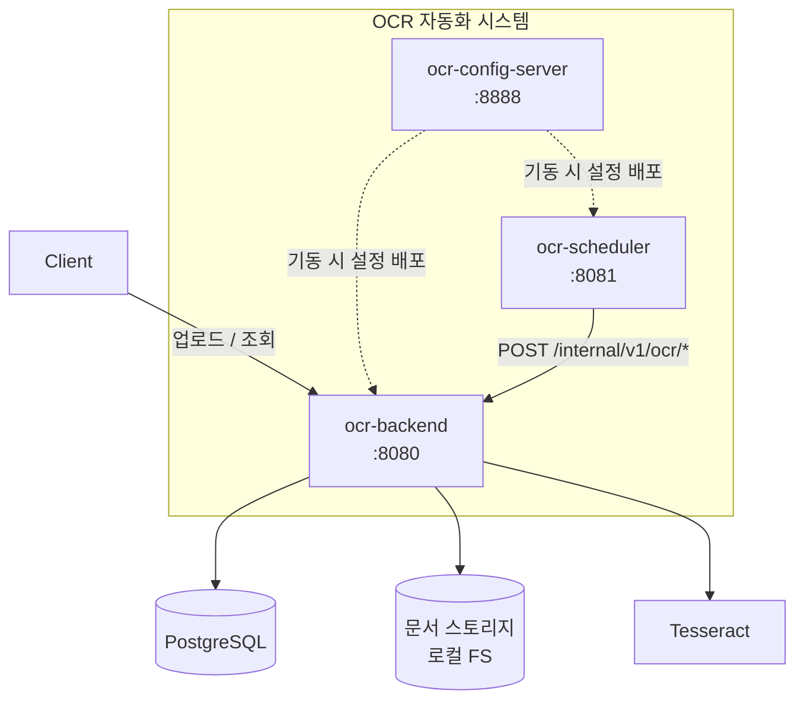
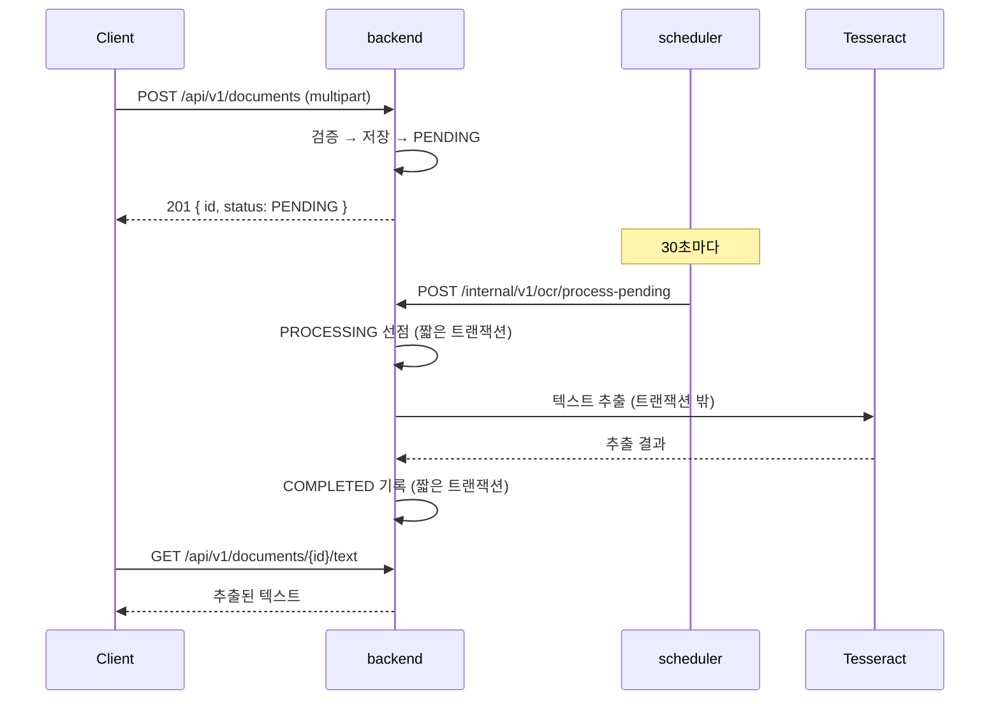

# ai.ocr-automation.system

문서를 올리면 OCR 로 텍스트를 뽑아 보관하는 **OCR 자동화 시스템**.

이 저장소는 **엄브렐라 저장소**다. 실제 코드는 서브모듈로 연결된 서비스 저장소에 있고,
여기에는 시스템 전체를 어떻게 맞춰 돌리는지가 들어 있다.

<br>

## 🧩 구성

| 서비스 | 포트 | 역할 | 저장소 |
|---|---|---|---|
| **config.server** | 8888 | 중앙 설정 관리 | [ai.ocr-automation.system-config.server](https://github.com/hyunolike/ai.ocr-automation.system-config.server) |
| **backend** | 8080 | 문서 API + OCR 처리 | [ai.ocr-automation.system-backend](https://github.com/hyunolike/ai.ocr-automation.system-backend) |
| **backend.scheduler** | 8081 | 배치 잡 트리거 | [ai.ocr-automation.system-backend.scheduler](https://github.com/hyunolike/ai.ocr-automation.system-backend.scheduler) |



### 왜 이렇게 나눴나

| 경계 | 이유 |
|---|---|
| 설정을 서비스 밖으로 | DB 접속 정보가 저장소마다 흩어지지 않고, 잡 주기를 재배포 없이 바꾼다 |
| 스케줄러를 backend 밖으로 | Tesseract 네이티브 의존성을 backend 한곳에만 둔다. 처리량이 필요하면 backend 만 늘린다 |
| OCR 실행은 backend 안에 | 스케줄러는 **"언제"만** 알고 **"어떻게"는 모른다**. 엔진을 바꿔도 스케줄러는 그대로다 |

<br>

## 🔄 문서 한 건의 흐름



문서 상태는 `PENDING → PROCESSING → COMPLETED`, 실패하면 재시도 여유에 따라
`PENDING` 으로 돌아가거나 `FAILED` 로 확정된다. 처리 중 인스턴스가 죽어 `PROCESSING` 에
멈춘 문서는 스케줄러의 **회수 잡**이 다시 `PENDING` 으로 돌려놓는다.

<br>

## 🏃 시작하기

### 1. 저장소 받기

서브모듈까지 함께 받아야 한다.

```bash
git clone --recurse-submodules https://github.com/hyunolike/ai.ocr-automation.system.git
cd ai.ocr-automation.system

# 이미 받았다면
git submodule update --init --recursive
```

### 2. 실행

**기동 순서가 중요하다.** backend 와 scheduler 는 설정 서버에서 설정을 받아야 뜬다.

```bash
# (선택) 운영 프로파일로 돌릴 때만 필요. local 프로파일은 H2 를 쓴다
docker compose up -d postgres

# 터미널 1 — 설정 서버
cd config.server && ./gradlew bootRun

# 터미널 2 — 백엔드
cd backend && ./gradlew bootRun

# 터미널 3 — 스케줄러
cd backend.scheduler && ./gradlew bootRun
```

기본 프로파일은 `local` 이다. **H2 인메모리 + stub OCR 엔진**으로 뜨므로
PostgreSQL 도 Tesseract 도 없이 파이프라인 전체를 돌려볼 수 있다.

### 3. 동작 확인

```bash
./scripts/upload-sample.sh path/to/scan.png

# 소유자를 바꿔 격리를 확인해 볼 수 있다
OWNER_ID=alice ./scripts/upload-sample.sh path/to/scan.png
```

업로드 → 처리 → 상태 → 추출 텍스트까지 한 번에 보여준다.

<br>

## ⚙️ 프로파일

| 프로파일 | DB | OCR 엔진 | 용도 |
|---|---|---|---|
| `local` (기본) | H2 (PostgreSQL 모드) | `stub` | 외부 의존 없이 파이프라인 확인 |
| `default` | PostgreSQL | `tesseract` | 운영 |

```bash
# 운영 프로파일로
SPRING_PROFILES_ACTIVE=default ./gradlew bootRun
```

스키마 출처는 두 프로파일 모두 **Flyway 하나**다. JPA 는 `validate` 만 하므로
엔티티와 마이그레이션이 어긋나면 기동 단계에서 바로 드러난다.

<br>

## 📄 주요 API

| Method | Path | 설명 |
|---|---|---|
| `POST` | `/api/v1/documents` | 문서 업로드 (multipart, 필드명 `file`) |
| `GET` | `/api/v1/documents/{id}` | 상태·결과 요약 |
| `GET` | `/api/v1/documents?status=` | 목록 (상태 필터) |
| `GET` | `/api/v1/documents/{id}/text` | 추출된 전체 텍스트 |

모든 공개 API 는 `X-Owner-Id` 헤더를 요구한다.
**이 헤더는 인증이 아니라** 소유자 격리를 위한 자리표시자이며, Phase 1.3 에서 교체된다.

자세한 내용은 [backend README](https://github.com/hyunolike/ai.ocr-automation.system-backend#-api) 참고.

<br>

## 🛠 기술 스택

| 영역 | 기술 |
|---|---|
| 언어 | Java 21 |
| 프레임워크 | Spring Boot 3.5.16 |
| 설정 관리 | Spring Cloud Config (2025.0.3) |
| 영속성 | Spring Data JPA, PostgreSQL 16 / H2 |
| 마이그레이션 | Flyway |
| OCR | Tesseract (tess4j 5.20.0) |
| 빌드 | Gradle 8.14.3 |

<br>

## 📁 저장소 구조

```
ai.ocr-automation.system/          # 이 저장소 (엄브렐라)
├── config.server/                 # 서브모듈
├── backend/                       # 서브모듈
├── backend.scheduler/             # 서브모듈
├── docs/ARCHITECTURE.md           # 설계 결정과 배경
├── docs/ROADMAP.md                # 앞으로의 설계 (단계별 계획)
├── docker-compose.yml             # 로컬 PostgreSQL
└── scripts/upload-sample.sh       # 동작 확인 스크립트
```

서브모듈을 최신으로 맞추려면:

```bash
git submodule update --remote --merge
```

<br>

## 📚 문서

- [docs/ARCHITECTURE.md](docs/ARCHITECTURE.md) — 경계를 이렇게 나눈 이유, 상태 머신, 트랜잭션 전략
- [docs/ROADMAP.md](docs/ROADMAP.md) — **앞으로의 설계.** 현재 결함, 단계별 계획, 하지 않기로 한 것
- 각 서비스 README — 서비스별 상세 설계와 한계

<br>

## ⚠️ 현재 단계

**초기 구조를 잡은 상태다.** 파이프라인은 끝까지 동작하지만,
실사용 전에 해결해야 할 것들이 남아 있다.

- **인증이 없다** — 소유자 격리는 들어왔지만 `X-Owner-Id` 헤더를 그대로 믿는다. `/internal` API 와 설정 서버도 열려 있다
- **스케줄러 다중화 시 잡이 중복 실행된다** — 분산 락(ShedLock)이 없다
- **설정 값이 평문이다** — DB 비밀번호 암호화(`{cipher}`)가 없다
- **컨테이너 이미지가 없다** — 각 서비스에 Dockerfile 과 CI 가 필요하다
- **파일 내용을 검증하지 않는다** — `Content-Type` 헤더만 믿는다
- **원본 문서를 정리하지 않는다** — 보관 기간 정책이 없다

서비스별 한계는 각 저장소 README 의 "알려진 한계" 절에 정리해 두었다.

<br>

## 🗺 로드맵

단계별 설계는 [docs/ROADMAP.md](docs/ROADMAP.md) 에 있다. 요약하면:

| Phase | 목표 | 주요 항목 |
|---|---|---|
| ~~**0**~~ | ~~확인된 결함 수정~~ | ✅ 완료 — 배치 타임아웃 초과 외 3건 |
| **1** | 운영 투입 차단 해소 | ~~파이프라인 비동기화~~ ✅, ~~소유자 도입~~ ✅, **인증·인가 ← 다음**, 파일 검증, 설정 암호화 |
| **2** | 배포 가능하게 | 컨테이너 이미지, CI, 관측성, API 문서 |
| **3** | 인식 정확도 | 이미지 전처리, 신뢰도 수집, `NEEDS_REVIEW` 상태, PDF 페이지 처리 |
| **4** | 규모 | S3 어댑터, 보관 정책, 큐 전환 판단 |
| **5** | 구조화 추출 | 텍스트가 아니라 데이터를 준다 |

**다음에 할 일은 1.3 인증·인가**다. 소유자 격리는 들어왔지만 소유자를 *증명*하는
장치가 없다 — 지금은 `X-Owner-Id` 헤더를 그대로 믿는다. `/internal` API 도 공개 포트에
열려 있어 누구나 배치를 돌릴 수 있다.
