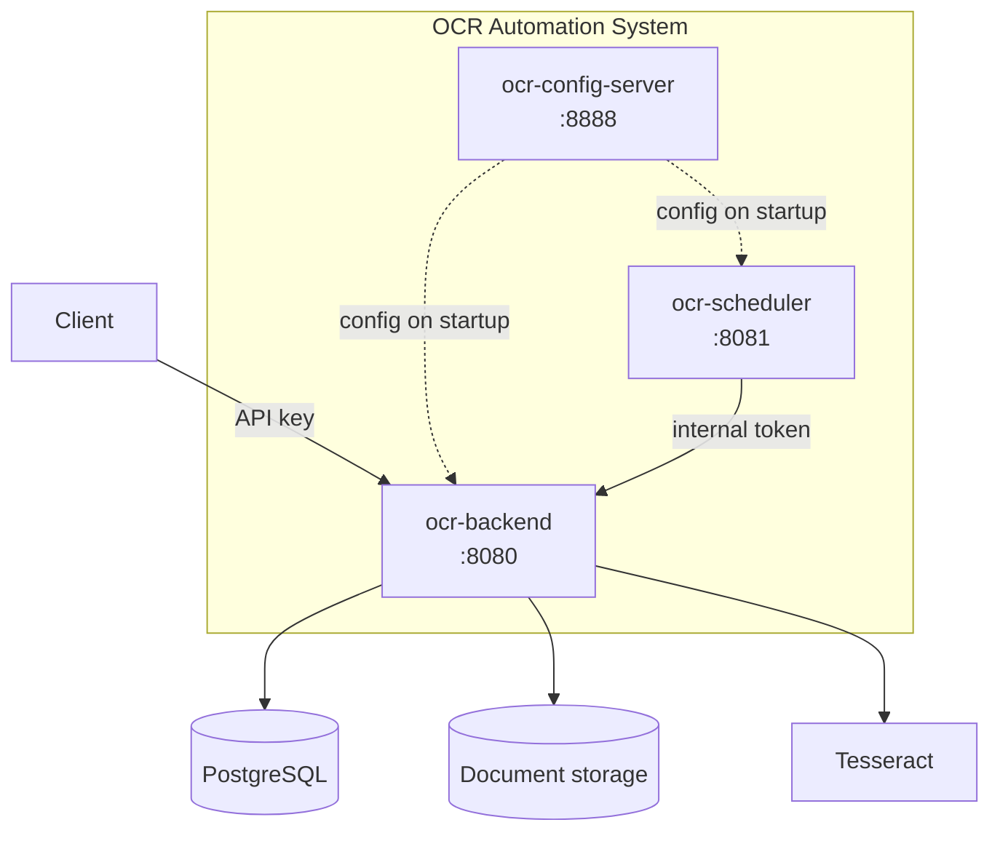
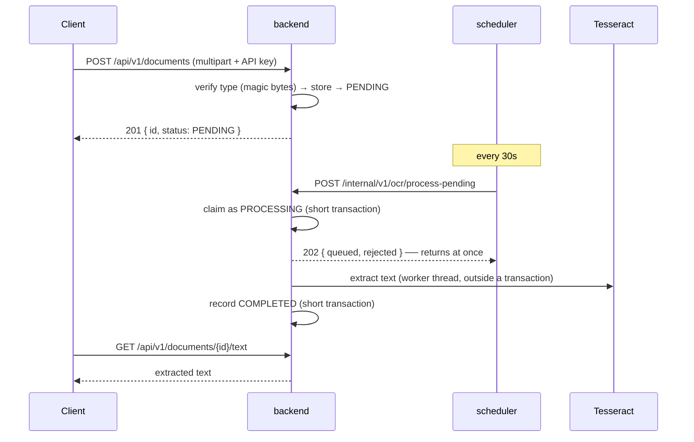

# OCR Automation System

**English** | [한국어](README.ko.md) | [简体中文](README.zh-CN.md) | [日本語](README.ja.md)

> Upload a document, get its text extracted by OCR and kept.
> Three services built on **Spring Boot + Tesseract + Spring Cloud Config**.

OCR is slow, it fails often, and the engine gets replaced. Taking those three as
given, the goal is to make sure **slow work never pins a request**, **a failure never
loses a document**, and **swapping the engine leaves the business logic untouched**.

This is the **umbrella repository**. The actual code lives in the service repositories
linked as submodules; what's here is how the whole thing fits together and runs.

<br>

## 🎯 Design Goals

- **One responsibility per boundary** — configuration to the config server, "when" to the scheduler, "how" to the backend
- **Cut what will change behind ports** — the OCR engine and storage change by swapping adapters
- **Design for failure** — even when an instance dies, documents get recovered and reprocessed
- **Better to fail closed than to fail open** — a path without a rule is denied

<br>

## 🧩 Components

| Service | Port | Role | Repository |
|---|---|---|---|
| **config.server** | 8888 | Central configuration | [ai.ocr-automation.system-config.server](https://github.com/hyunolike/ai.ocr-automation.system-config.server) |
| **backend** | 8080 | Document API + OCR processing | [ai.ocr-automation.system-backend](https://github.com/hyunolike/ai.ocr-automation.system-backend) |
| **backend.scheduler** | 8081 | Batch job triggers | [ai.ocr-automation.system-backend.scheduler](https://github.com/hyunolike/ai.ocr-automation.system-backend.scheduler) |



### Why split it this way

| Boundary | Reason |
|---|---|
| Configuration outside the services | Database credentials stop scattering across repositories, and job cadence changes without a redeploy |
| Scheduler outside the backend | The Tesseract native dependency stays in one place. Need throughput? Scale only the backend |
| OCR execution inside the backend | The scheduler knows **only "when"** and **nothing of "how"**. Swap the engine and the scheduler is untouched |

<br>

## 🚀 Functional Requirements

### Document processing

- Upload an image (PNG/JPEG/TIFF) or a PDF and it joins the OCR queue.
- File type is decided from **its content (magic bytes), not the header.**
- The scheduler periodically has the backend **accept** pending documents into its worker pool.
- Failures are retried; past the limit, the document is marked `FAILED`.
- Documents stuck in `PROCESSING` because an instance died get recovered and reprocessed.

### Authentication and isolation

- Public APIs require an **API key**. The key determines the owner.
- Every query is scoped to its owner. Someone else's document answers **404**.
- Service-to-service calls (`/internal`) are guarded by a shared token.
- The config server is behind basic auth, and values can be encrypted with `{cipher}`.

<br>

## 🔄 How a document flows



```
PENDING ──▶ PROCESSING ──▶ COMPLETED
   ▲             │
   │             └──▶ FAILED (retries exhausted)
   └─────────────┘
     goes back while retries remain
```

<br>

## 📄 Main API

Every public API requires an **API key** (`X-API-Key` or `Authorization: Bearer`).
The key determines the owner; nowhere in a request is there a place to name one.

| Method | Path | Description |
|---|---|---|
| `POST` | `/api/v1/documents` | Upload (multipart, field `file`) |
| `GET` | `/api/v1/documents/{id}` | Status and result summary |
| `GET` | `/api/v1/documents?status=` | List (status filter) |
| `GET` | `/api/v1/documents/{id}/text` | Full extracted text |

Internal APIs are guarded by a shared token (`X-Internal-Token`).
See the [backend README](https://github.com/hyunolike/ai.ocr-automation.system-backend#-interface-specification) for details.

<br>

## 📐 Programming Requirements

- Java 21 and Spring Boot 3.5.16 across all three services.
- Each service is its **own repository**; this one binds them as submodules.
- All configuration comes from the config server. Each service's `application.yml`
  holds **only "how to find the config server."**
- The schema has a **single source, Flyway.** JPA only `validate`s.
- Startup order is **config server → backend → scheduler**.
- **Commit granularity follows the feature checklist below.**

<br>

## ✅ Feature Checklist

### Phase 0 — Defects found

- [x] Batches processed sequentially, exceeding the scheduler's timeout
- [x] `@Transactional` not applied because of a self-invocation
- [x] Re-uploading a failed document did nothing
- [x] A configuration key no code reads

### Phase 1 — Clearing what blocks production

- [x] Asynchronous processing pipeline (bounded queue + backpressure)
- [x] Document ownership (owner condition on every public query)
- [x] Authentication (API key / internal token / config server basic auth)
- [x] Upload content verification (magic bytes + PDF inspection)
- [x] Config value encryption

### Phase 2 — Getting deployable

- [ ] Container images (Tesseract only in the backend image)
- [ ] Full docker-compose setup
- [ ] CI (build and test, submodule combination check)
- [ ] Observability (pending count, processing time, queue saturation, recoveries)
- [ ] Generated OpenAPI documentation

### Phase 3 — Recognition accuracy

- [ ] Image preprocessing (resolution normalisation, binarisation, deskew)
- [ ] Word-level Tesseract confidence
- [ ] `NEEDS_REVIEW` status — separating what a human must look at
- [ ] Per-page PDF processing

### Phase 4 — Scale

- [ ] S3 storage adapter
- [ ] Retention policy and cleanup job
- [ ] Decide on a message queue

### Phase 5 — Structured extraction

- [ ] Document type classification
- [ ] Structured fields from the recognised text
- [ ] Compare against a vision-model adapter

<br>

## 📤 Results

> Messages are in Korean because they come straight from the service code.

### Upload → process → query

```bash
$ ./scripts/upload-sample.sh scan.png
▶ API 키 발급 (소유자: demo)
   ocrk_nRXV7l5...  (평문은 발급 응답에서만 볼 수 있다)

▶ 업로드: scan.png
{"id":"a1964f60-...","status":"PENDING","ocrResult":null}

▶ OCR 처리 접수
{"queued":1,"rejected":0,"skipped":0}

▶ 상태
{"id":"a1964f60-...","status":"COMPLETED","ocrResult":{"engine":"stub","textLength":85,...}}

▶ 추출 텍스트
[stub-ocr] 실제 인식이 수행되지 않았습니다.
```

### The scheduler picks it up on its own

Upload and wait — no manual call needed.

```
INFO c.o.a.s.job.PendingDocumentDispatchJob : 대기 문서 접수 완료: queued=1, skipped=0
```

### Owner isolation

```bash
$ curl -H "X-API-Key: $BOB_KEY" .../documents/$ALICE_DOC
{"code":"DOCUMENT_NOT_FOUND","message":"문서를 찾을 수 없습니다: e04fb648-..."}
```

When two owners upload the same file, they each get **their own document.**
Global checksums would hand back the other owner's document id.

### A disguised upload

```bash
$ curl -H "X-API-Key: $KEY" -F "file=@evil.png;type=image/png" .../documents
{"code":"CONTENT_MISMATCH","message":"파일 내용이 image/png 형식이 아닙니다"}
```

<br>

## 🛠 Tech Stack

| Area | Technology |
|---|---|
| Language | Java 21 |
| Framework | Spring Boot 3.5.16 |
| Configuration | Spring Cloud Config (2025.0.3) |
| Authentication | Spring Security (API key / shared token / basic auth) |
| Persistence | Spring Data JPA, PostgreSQL 16 / H2 |
| Migration | Flyway |
| OCR | Tesseract (tess4j 5.20.0) |
| PDF inspection | Apache PDFBox |
| Build | Gradle 8.14.3 |

<br>

## 🏃 Getting Started

### 1. Clone

Submodules have to come along.

```bash
git clone --recurse-submodules https://github.com/hyunolike/ai.ocr-automation.system.git
cd ai.ocr-automation.system

# already cloned?
git submodule update --init --recursive
```

### 2. Run

**Startup order matters.** The backend and the scheduler need configuration before they start.

```bash
# (optional) only for the production profile; local uses H2
docker compose up -d postgres

# Terminal 1 — config server
cd config.server && ./gradlew bootRun

# Terminal 2 — backend
cd backend && ./gradlew bootRun

# Terminal 3 — scheduler
cd backend.scheduler && ./gradlew bootRun
```

The default profile is `local`: **in-memory H2 + the stub OCR engine**, so you can run
the whole pipeline without PostgreSQL or Tesseract.

### 3. Try it

```bash
# Without an API key it issues one through the internal path first
./scripts/upload-sample.sh path/to/scan.png

# Change the owner to see isolation at work
OWNER_ID=alice ./scripts/upload-sample.sh path/to/scan.png
```

### Profiles

| Profile | Database | OCR engine | Purpose |
|---|---|---|---|
| `local` (default) | H2 (PostgreSQL mode) | `stub` | Run the pipeline with no external dependencies |
| `default` | PostgreSQL | `tesseract` | Production |

Both profiles take the schema from **Flyway alone**, with JPA only `validate`ing,
so an entity that drifts from a migration shows up right at startup.

<br>

## 📁 Repository Layout

```
ai.ocr-automation.system/          # this repository (umbrella)
├── config.server/                 # submodule
├── backend/                       # submodule
├── backend.scheduler/             # submodule
├── docs/
│   ├── ARCHITECTURE.md            # why the boundaries, state machine, transaction strategy
│   └── ROADMAP.md                 # the design ahead, and what we decided not to do
├── docker-compose.yml             # local PostgreSQL
└── scripts/upload-sample.sh       # end-to-end check
```

To bring submodules up to date:

```bash
git submodule update --remote --merge
```

<br>

## 🤔 Design Decisions

| Topic | Choice | Why |
|---|---|---|
| Service split | Configuration / processing / scheduling | Keeps the Tesseract dependency in one place; scale only the backend when throughput is needed |
| Repository layout | Separate repositories + submodules | Services deploy on different cadences. The umbrella pins the combination |
| Processing model | Acceptance + worker pool instead of synchronous processing | `batch size × per-document time` exceeds the caller's timeout |
| Lost work | In-memory queue + stall recovery | A crash leaves documents in `PROCESSING`, which the recovery job collects. No broker added |
| Engine and storage | Behind ports | At the scaffolding stage, the one certainty is that these will change |
| Authentication | Different per lane | External clients, service-to-service and operations differ. One mechanism serves none of them well |
| Ownership | Start with `owner_id` alone | Adding `tenant_id` is one migration; removing an unneeded tenant concept is not |
| Distributed lock | Deferred | Since dispatch became asynchronous, duplicate calls cost almost nothing. The earlier step removed the need for the later one |
| Development defaults | The name is the warning | Between a visible risk and an invisible friction, we chose the former |

<br>

## ⚠️ Known Simplifications

Phase 1 is complete. The pipeline runs end to end with authentication, isolation and
verification in place, but things remain before real use.

- **No HTTPS** — the API key and internal token travel in the clear.
- **Development default credentials exist** — they log a warning when used, but without environment variables in production there is no protection.
- **Operator rights share the service-to-service token** — the scheduler's token can also mint API keys.
- **No container images** — each service needs a Dockerfile and CI.
- **No observability** — whether processing is falling behind is visible only in the log.
- **OCR confidence isn't collected** — there's no basis for deciding whether to trust a result.
- **Local filesystem storage** — scaling the backend out means instances can't share files.
- **Originals are never cleaned up** — there is no retention policy.

Per-service limitations are listed under "Known Simplifications" in each repository's README.

<br>

## 📚 Documentation

- [docs/ARCHITECTURE.md](docs/ARCHITECTURE.md) — why the boundaries, ports and adapters, state machine, transaction strategy, authentication
- [docs/ROADMAP.md](docs/ROADMAP.md) — staged design, what was actually done, and **what we decided not to do**
- Each service README — per-service design and limitations

<br>

## 🗺 Roadmap

**Next is Phase 2 — getting deployable.** Without container images and CI, this can't
go on a server yet.

- [ ] Dockerfiles + a full docker-compose setup
- [ ] CI (build and test, submodule combination check)
- [ ] Observability — pending count, processing time, queue saturation, recoveries
- [ ] Generated OpenAPI documentation
- [ ] HTTPS termination and operator rights separation
- [ ] Image preprocessing and a confidence-based `NEEDS_REVIEW`
- [ ] S3 storage adapter
- [ ] Retention policy and cleanup job
