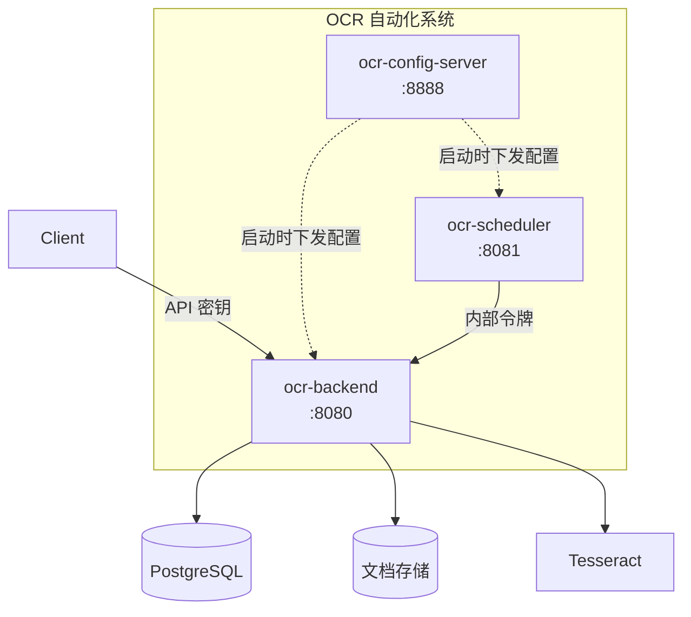
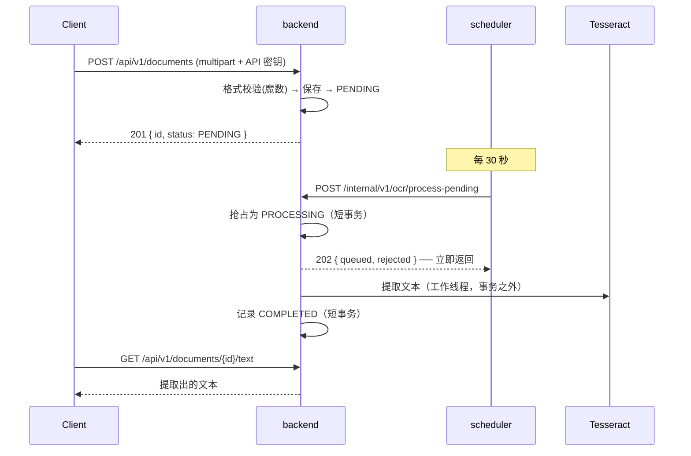

# OCR 自动化系统

[English](README.md) | [한국어](README.ko.md) | **简体中文** | [日本語](README.ja.md)

> 上传文档后用 OCR 提取文本并保存的系统。
> 由 **Spring Boot + Tesseract + Spring Cloud Config** 构成的三个服务。

OCR 慢、经常失败、引擎还会更换。以这三点为前提，目标是做到
**慢任务不占住请求**、**失败也不丢文档**、**换引擎时业务逻辑原封不动**。

本仓库是**伞形仓库**。实际代码在以子模块连接的各服务仓库中，
这里放的是如何把整个系统拼起来运行。

<br>

## 🎯 设计目标

- **每个边界只承担一项职责**——配置归配置服务器，"何时"归调度器，"如何"归 backend
- **把会变的东西用端口切开**——OCR 引擎与存储通过替换适配器来更换
- **以失败为前提设计**——即使实例宕机，文档也会被回收并重新处理
- **宁可误拦也不误放**——规则未覆盖的路径一律拒绝

<br>

## 🧩 组成

| 服务 | 端口 | 职责 | 仓库 |
|---|---|---|---|
| **config.server** | 8888 | 中央配置管理 | [ai.ocr-automation.system-config.server](https://github.com/hyunolike/ai.ocr-automation.system-config.server) |
| **backend** | 8080 | 文档 API + OCR 处理 | [ai.ocr-automation.system-backend](https://github.com/hyunolike/ai.ocr-automation.system-backend) |
| **backend.scheduler** | 8081 | 批处理作业触发 | [ai.ocr-automation.system-backend.scheduler](https://github.com/hyunolike/ai.ocr-automation.system-backend.scheduler) |



### 为什么这样拆分

| 边界 | 理由 |
|---|---|
| 把配置移到服务之外 | 数据库连接信息不再散落在各仓库，作业周期也无需重新部署就能改 |
| 把调度器移到 backend 之外 | Tesseract 原生依赖只放在一处。需要吞吐量时只扩 backend |
| OCR 执行放在 backend 内 | 调度器**只知道"何时"**，**不知道"如何"**。换引擎时调度器无需改动 |

<br>

## 🚀 功能需求

### 文档处理

- 上传图片（PNG/JPEG/TIFF）或 PDF 后进入 OCR 队列。
- 文件格式**依据内容（魔数）判断，而不是请求头。**
- 调度器周期性地让 backend 把待处理文档**受理**进工作线程池。
- 处理失败会重试，超出上限则确定为 `FAILED`。
- 因实例宕机而停留在 `PROCESSING` 的文档会被回收并重新处理。

### 认证与隔离

- 公开 API 需要 **API 密钥**。密钥决定所有者。
- 所有查询都收敛到所有者范围。他人的文档返回 **404**。
- 服务间调用 (`/internal`) 用共享令牌拦住。
- 配置服务器用基本认证拦住，配置值可用 `{cipher}` 加密。

<br>

## 🔄 一份文档的流转



```
PENDING ──▶ PROCESSING ──▶ COMPLETED
   ▲             │
   │             └──▶ FAILED（重试次数耗尽）
   └─────────────┘
     还有重试余量时退回
```

<br>

## 📄 主要 API

所有公开 API 都需要 **API 密钥**（`X-API-Key` 或 `Authorization: Bearer`）。
密钥决定所有者，请求中没有任何地方可以指定所有者。

| Method | Path | 说明 |
|---|---|---|
| `POST` | `/api/v1/documents` | 文档上传（multipart，字段名 `file`） |
| `GET` | `/api/v1/documents/{id}` | 状态与结果摘要 |
| `GET` | `/api/v1/documents?status=` | 列表（状态过滤） |
| `GET` | `/api/v1/documents/{id}/text` | 提取出的全文 |

内部 API 由共享令牌（`X-Internal-Token`）保护。
详情参见 [backend README](https://github.com/hyunolike/ai.ocr-automation.system-backend#-接口规格)。

<br>

## 📐 编程要求

- 三个服务统一使用 Java 21、Spring Boot 3.5.16。
- 每个服务都是**独立仓库**，由本仓库以子模块方式绑定。
- 配置全部由配置服务器下发。各服务的 `application.yml` 里
  **只放"如何找到配置服务器"**。
- 表结构以 **Flyway 为唯一来源**。JPA 只做 `validate`。
- 启动顺序为 **配置服务器 → backend → scheduler**。
- **提交粒度以下面的功能清单为单位。**

<br>

## ✅ 功能清单

### Phase 0 — 已确认的缺陷

- [x] 批处理为顺序执行，超过调度器超时
- [x] 自调用导致 `@Transactional` 未生效
- [x] 失败文档重新上传后无任何反应
- [x] 代码根本不读取的死配置键

### Phase 1 — 解除投产阻塞

- [x] 处理流水线异步化（有界队列 + 背压）
- [x] 为文档引入所有者（所有公开查询都带所有者条件）
- [x] 认证与授权（API 密钥 / 内部令牌 / 配置服务器基本认证）
- [x] 上传文件内容校验（魔数 + PDF 检查）
- [x] 配置值加密功能

### Phase 2 — 达到可部署

- [ ] 容器镜像（tesseract 只放进 backend 镜像）
- [ ] 完整的 docker-compose 配置
- [ ] CI（构建·测试，子模块组合验证）
- [ ] 可观测性（待处理数、处理耗时、队列饱和、回收件数）
- [ ] OpenAPI 文档自动生成

### Phase 3 — 识别准确度

- [ ] 图像预处理（分辨率归一化·二值化·倾斜校正）
- [ ] Tesseract 单词级置信度采集
- [ ] `NEEDS_REVIEW` 状态——区分出需要人工确认的文档
- [ ] PDF 逐页处理

### Phase 4 — 规模

- [ ] S3 存储适配器
- [ ] 文档保留期策略与清理批处理
- [ ] 消息队列的迁移判断

### Phase 5 — 结构化抽取

- [ ] 文档类型分类
- [ ] 从提取文本中抽取结构化字段
- [ ] 与视觉模型适配器做对比

<br>

## 📤 运行结果

> 消息为韩文，因为直接来自服务代码。

### 上传 → 处理 → 查询

```bash
$ ./scripts/upload-sample.sh scan.png
▶ API 키 발급 (소유자: demo)
   ocrk_nRXV7l5...  (평문은 발급 응답에서만 볼 수 있다)

▶ 업로드: scan.png
{"id":"a1964f60-...","status":"PENDING","ocrResult":null}

▶ OCR 처리 접수
{"queued":1,"rejected":0,"skipped":0}

▶ 상태
{"id":"a1964f60-...","status":"COMPLETED","ocrResult":{"engine":"stub","textLength":85,...}}

▶ 추출 텍스트
[stub-ocr] 실제 인식이 수행되지 않았습니다.
```

### 调度器会自动取走

只管上传然后等待，无需手动调用。

```
INFO c.o.a.s.job.PendingDocumentDispatchJob : 대기 문서 접수 완료: queued=1, skipped=0
```

### 所有者隔离

```bash
$ curl -H "X-API-Key: $BOB_KEY" .../documents/$ALICE_DOC
{"code":"DOCUMENT_NOT_FOUND","message":"문서를 찾을 수 없습니다: e04fb648-..."}
```

两个所有者上传同一个文件时，会**各自生成独立文档**。
若用全局校验和，就会拿到别人的文档 ID。

### 伪装格式的上传

```bash
$ curl -H "X-API-Key: $KEY" -F "file=@evil.png;type=image/png" .../documents
{"code":"CONTENT_MISMATCH","message":"파일 내용이 image/png 형식이 아닙니다"}
```

<br>

## 🛠 技术栈

| 领域 | 技术 |
|---|---|
| 语言 | Java 21 |
| 框架 | Spring Boot 3.5.16 |
| 配置管理 | Spring Cloud Config (2025.0.3) |
| 认证 | Spring Security（API 密钥 / 共享令牌 / 基本认证） |
| 持久化 | Spring Data JPA、PostgreSQL 16 / H2 |
| 迁移 | Flyway |
| OCR | Tesseract (tess4j 5.20.0) |
| PDF 检查 | Apache PDFBox |
| 构建 | Gradle 8.14.3 |

<br>

## 🏃 运行方式

### 1. 拉取仓库

必须连同子模块一起拉取。

```bash
git clone --recurse-submodules https://github.com/hyunolike/ai.ocr-automation.system.git
cd ai.ocr-automation.system

# 如果已经拉过了
git submodule update --init --recursive
```

### 2. 运行

**启动顺序很重要。** backend 与 scheduler 必须先从配置服务器拿到配置才能起来。

```bash
# （可选）仅在用生产 profile 时需要。local profile 使用 H2
docker compose up -d postgres

# 终端 1 — 配置服务器
cd config.server && ./gradlew bootRun

# 终端 2 — 后端
cd backend && ./gradlew bootRun

# 终端 3 — 调度器
cd backend.scheduler && ./gradlew bootRun
```

默认 profile 为 `local`。以 **H2 内存库 + stub OCR 引擎**启动，
不需要 PostgreSQL 也不需要 Tesseract 就能跑通整条流水线。

### 3. 验证

```bash
# 没有 API 密钥时会先通过内部路径签发一个
./scripts/upload-sample.sh path/to/scan.png

# 换个所有者可以验证隔离
OWNER_ID=alice ./scripts/upload-sample.sh path/to/scan.png
```

### Profile

| Profile | 数据库 | OCR 引擎 | 用途 |
|---|---|---|---|
| `local`（默认） | H2（PostgreSQL 模式） | `stub` | 无外部依赖地验证流水线 |
| `default` | PostgreSQL | `tesseract` | 生产 |

两个 profile 的表结构来源都是 **Flyway 唯一来源**，JPA 只做 `validate`，
因此实体与迁移脚本不一致时会在启动阶段立刻暴露。

<br>

## 📁 仓库结构

```
ai.ocr-automation.system/          # 本仓库（伞形）
├── config.server/                 # 子模块
├── backend/                       # 子模块
├── backend.scheduler/             # 子模块
├── docs/
│   ├── ARCHITECTURE.md            # 边界划分理由、状态机、事务策略
│   └── ROADMAP.md                 # 后续设计、决定不做的事
├── docker-compose.yml             # 本地 PostgreSQL
└── scripts/upload-sample.sh       # 端到端验证脚本
```

同步子模块到最新：

```bash
git submodule update --remote --merge
```

<br>

## 🤔 设计考量

| 主题 | 选择 | 理由 |
|---|---|---|
| 服务拆分 | 配置 / 处理 / 调度 三块 | 把 Tesseract 依赖集中在一处，需要吞吐量时只扩 backend |
| 仓库构成 | 独立仓库 + 子模块 | 各服务部署节奏不同。伞形仓库负责固定组合 |
| 处理方式 | 用受理 + 工作线程池取代同步处理 | `批次大小 × 单件耗时` 会超过调用方超时 |
| 任务丢失 | 内存队列 + 停滞回收 | 宕机后文档处于 `PROCESSING`，回收作业会收走。没有引入 broker |
| 引擎与存储 | 用端口切开 | 初期结构中最确定的一件事就是它们以后会变 |
| 认证方式 | 按通道分别设计 | 外部客户端·服务间·运维性质不同，用一种方式则哪一层都做不好 |
| 所有者 | 先只用 `owner_id` | 加 `tenant_id` 只是一次迁移，但要拿掉多余的租户概念很难 |
| 分布式锁 | 暂缓 | 改为异步受理后重复调用成本几乎消失。前一步消除了后一步的必要 |
| 开发默认值 | 用名字本身作为警告 | 在"看得见的风险"与"看不见的摩擦"之间选择了前者 |

<br>

## ⚠️ 已知简化

Phase 1 已经完成。流水线能跑通，认证·隔离·校验也已具备，
但实际投产前仍有待解决的事项。

- **没有 HTTPS**——API 密钥与内部令牌以明文传输。
- **存在开发默认凭据**——使用时会有启动告警，但生产环境不指定环境变量就等于没有保护。
- **运维权限与服务间令牌相同**——用调度器的令牌也能签发 API 密钥。
- **没有容器镜像**——各服务需要 Dockerfile 与 CI。
- **没有可观测性**——处理是否积压只能从日志判断。
- **不采集 OCR 置信度**——没有判断结果是否可信的依据。
- **本地文件系统存储**——backend 横向扩展后无法共享文件。
- **不清理原始文档**——没有保留期策略。

各服务的限制整理在各仓库 README 的"已知简化"一节。

<br>

## 📚 文档

- [docs/ARCHITECTURE.md](docs/ARCHITECTURE.md)——边界划分理由、端口/适配器、状态机、事务策略、认证
- [docs/ROADMAP.md](docs/ROADMAP.md)——分阶段设计、实际做了什么、**以及决定不做的事**
- 各服务 README——各服务的详细设计与限制

<br>

## 🗺 后续计划

**下一步是 Phase 2 — 达到可部署。** 没有容器镜像和 CI，目前还无法部署到服务器。

- [ ] Dockerfile + 完整 docker-compose 配置
- [ ] CI（构建·测试自动化，子模块组合验证）
- [ ] 可观测性——待处理数、处理耗时、队列饱和、回收件数
- [ ] OpenAPI 文档自动生成
- [ ] HTTPS 终结与运维权限分离
- [ ] 图像预处理与基于置信度的 `NEEDS_REVIEW`
- [ ] S3 存储适配器
- [ ] 文档保留期策略与清理批处理
