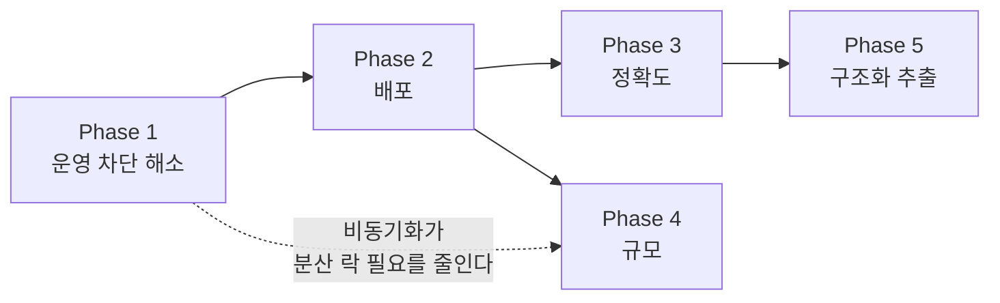

# 앞으로의 설계

> **진행 상황** — **Phase 1 을 모두 완료**했다. Phase 0 의 결함 4건과
> 1.1(비동기화), 1.2(소유자), 1.3(인증·인가), 1.4(파일 검증), 1.5(설정 암호화).
> 아래 해당 절에 ✅ 로 표시해 두었고, 무엇을 어떻게 했는지는 그대로 남긴다.
> 다음 차례는 **Phase 2 — 배포 가능하게**다.
>
> 1.3 은 설계에서 한 가지가 달라졌다. `/internal` 을 **별도 HTTP 포트**로 분리하려던
> 계획은 접었다 — 임의 컨트롤러를 다른 커넥터에 올리려면 자식 컨텍스트를 손봐야 해
> 얻는 것에 비해 취약하다. 대신 **actuator 만** `management.server.port` 로 분리하고
> (Boot 기본 기능), `/internal` 은 공유 토큰으로 막은 뒤 네트워크 차단을 배포 쪽
> 책임으로 문서화했다. 토큰은 2차 방어이고 1차는 여전히 네트워크다.

초기 구조([ARCHITECTURE.md](ARCHITECTURE.md))에서 실사용까지 가는 길을 단계로 나눈다.

문서의 원칙: **가까운 단계는 깊게, 먼 단계는 얕게.** Phase 4~5 를 지금 상세 설계하는 것은
낭비다. 그때쯤이면 전제가 바뀌어 있다. 대신 **판단 기준**을 남겨둔다.

<br>

## 0. 먼저 고쳐야 할 결함

설계 이전에, 지금 코드에 실재하는 문제 넷. 모두 현재 코드에서 확인했다.

### 0.1 배치 처리가 스케줄러 타임아웃을 넘는다 ✅ 완료

`DocumentProcessingService.processPending()` 은 배치를 **순차 처리**한다.

```java
for (Long documentId : targets) {     // batch-size 기본 20
    ...
    if (runOcr(claimed.get())) { ... }  // 건당 수 초
}
```

건당 5초면 20건에 100초다. 그런데 스케줄러의 읽기 타임아웃은 60초(`read-timeout-millis: 60000`)다.

**타임아웃이 먼저 터진다.** 그러면:

1. 스케줄러는 실패로 기록하고 다음 주기(30초)를 기다린다
2. backend 는 **여전히 처리 중**이다 — 요청이 끊겼을 뿐 작업은 돈다
3. 30초 뒤 스케줄러가 또 찌른다 → 요청이 중첩된다

낙관적 락 덕분에 문서가 두 번 처리되지는 않지만, backend 스레드는 계속 쌓인다.
**Phase 1.1 에서 구조로 해결한다.**

### 0.2 `@Transactional` 이 적용되지 않는 자기 호출 ✅ 완료

```java
public ProcessingSummary processPending(int batchSize) {
    List<Long> targets = pendingDocumentIds(batchSize);   // ← 자기 호출
}

@Transactional(readOnly = true)      // ← 프록시를 타지 않아 적용 안 됨
public List<Long> pendingDocumentIds(int batchSize) { ... }
```

Spring AOP 프록시는 외부 호출에만 걸린다. 동작 자체는 문제없다(Spring Data 리포지토리가
자기 트랜잭션을 연다). 하지만 **애노테이션이 사실과 다르다.** 읽는 사람을 속인다.

→ 애노테이션을 떼고 리포지토리 호출임을 분명히 하거나, 조회를 별도 빈으로 옮긴다.
Phase 1.1 에서 이 메서드를 손대므로 같이 정리한다.

### 0.3 실패한 문서는 재업로드해도 재처리되지 않는다 ✅ 완료

```java
Optional<Document> existing = documentRepository.findFirstByChecksumOrderByUploadedAtDesc(checksum);
if (existing.isPresent()) {
    return existing.get();     // FAILED 여도 그대로 돌려준다
}
```

중복 업로드를 막는 것은 맞지만, `FAILED` 로 끝난 문서까지 그대로 돌려준다.
사용자가 "실패했네, 다시 올려보자" 해도 **아무 일도 일어나지 않는다.**

→ 중복 판정에 상태를 넣는다. `FAILED` 면 재시도 횟수를 초기화하고 `PENDING` 으로 되돌린다.
`COMPLETED` / `PENDING` / `PROCESSING` 이면 지금처럼 기존 문서를 돌려준다.

### 0.4 아무도 읽지 않는 설정 키 ✅ 완료

설정 서버의 `ocr-scheduler.yml` 에 이런 키가 있다.

```yaml
stale-recovery:
  enabled: true
  cron: "0 0 * * * *"
  stale-after-minutes: 10     # ← 스케줄러 코드가 읽지 않는다
```

`SchedulerProperties.Jobs.StaleRecovery` 에는 `enabled` 밖에 없다. 실제 판정 기준은
backend 의 `ocr.processing.stale-after-minutes` 다. 같은 이름의 설정이 두 곳에 있고
**한쪽은 죽어 있다.** 나중에 이 값을 고치는 사람이 반드시 헷갈린다.

→ 스케줄러 쪽 키를 지운다. 회수 기준은 backend 가 단독으로 갖는다.

<br>

## 1. 단계 구분

| Phase | 목표 | 끝나면 |
|---|---|---|
| **1** | 운영 투입을 막는 것 제거 | 남에게 열어줄 수 있다 |
| **2** | 배포 가능하게 | 서버에 올릴 수 있다 |
| **3** | 인식 정확도 | 결과를 믿을 수 있다 |
| **4** | 규모 | 늘릴 수 있다 |
| **5** | 구조화 추출 | 텍스트가 아니라 **데이터**를 준다 |

순서의 근거: **1 없이 열 수 없고, 2 없이 올릴 수 없다.** 3 은 2 이후에 실제 문서로
측정해야 의미가 있다. 5 는 3 에 의존한다 — OCR 텍스트가 나쁘면 아무리 좋은 추출기도 나쁘다.



<br>

# Phase 1 — 운영 투입을 막는 것

## 1.1 처리 파이프라인 비동기화 ✅ 완료

### 문제

0.1 에서 본 타임아웃 충돌. 근본 원인은 **동기 요청 안에서 느린 작업을 끝까지 하려는 것**이다.
배치 크기나 타임아웃을 조정하는 것은 임시방편이다 — 문서가 커지면 다시 터진다.

### 설계

내부 API 를 **접수(accept)만 하고 즉시 반환**하게 바꾼다.

```
현재: POST /process-pending → [20건 전부 OCR] → 200 { picked, completed, failed }
변경: POST /process-pending → [워커 큐에 투입]  → 202 { queued, rejected }
```

backend 안에 고정 크기 워커 풀을 둔다.

```java
@Bean("ocrExecutor")
ThreadPoolTaskExecutor ocrExecutor(ProcessingProperties properties) {
    ThreadPoolTaskExecutor executor = new ThreadPoolTaskExecutor();
    executor.setCorePoolSize(properties.concurrency());       // 동시 OCR 수
    executor.setMaxPoolSize(properties.concurrency());
    executor.setQueueCapacity(properties.queueCapacity());    // 바운드 큐
    executor.setThreadNamePrefix("ocr-worker-");
    // 큐가 차면 거부한다. 호출 스레드가 대신 처리하면(CallerRuns) 타임아웃이 되살아난다.
    executor.setRejectedExecutionHandler(new ThreadPoolExecutor.AbortPolicy());
    return executor;
}
```

**바운드 큐 + AbortPolicy 가 백프레셔다.** 큐가 가득 차면 선점을 멈추고 거부 수를 돌려준다.
스케줄러는 다음 주기에 다시 시도한다. 무한히 쌓이지 않는다.

`CallerRunsPolicy` 를 쓰지 않는 이유: 호출 스레드(=HTTP 요청 스레드)가 OCR 을 대신 돌리면
지금과 똑같은 타임아웃 문제가 된다.

### 유실은 이미 감당하고 있다

인메모리 큐라 인스턴스가 죽으면 대기 중이던 작업이 사라진다. 하지만 그 문서들은
`PROCESSING` 으로 선점된 상태이고, **`recover-stalled` 잡이 이미 회수한다.**
구조가 이미 이 경우를 처리하도록 되어 있다 — 새로 만들 것이 없다.

### 바뀌는 것

| 대상 | 변경 |
|---|---|
| `DocumentProcessingService` | 선점 후 `ocrExecutor.submit(() -> runOcr(claimed))` |
| `ProcessingSummary` | `DispatchResult(queued, rejected, skipped)` 로 의미 변경 |
| `InternalProcessingController` | `202 Accepted` 반환 |
| 스케줄러 `read-timeout-millis` | `60000` → `5000` (접수만 하므로 길 이유가 없다) |
| 설정 추가 | `ocr.processing.concurrency`, `ocr.processing.queue-capacity` |
| 0.2 자기 호출 | 같이 정리 |

동시성 기본값은 **CPU 코어 수**에서 시작한다. Tesseract 는 CPU 바운드라 코어보다 많이
띄워도 처리량이 늘지 않고 메모리만 먹는다. 측정 후 조정한다(Phase 2.3 의 지표가 근거가 된다).

<br>

## 1.2 문서에 소유자를 도입한다 ✅ 완료

### 문제

지금 `GET /api/v1/documents` 는 **시스템의 모든 문서**를 돌려준다.
인증을 붙인다고 해결되지 않는다 — **도메인에 소유자 개념이 없기 때문이다.**

이것이 Phase 1 에서 인증(1.3)보다 먼저 와야 하는 이유다. 소유자 없이는 인가할 대상이 없다.

### 설계

`Document` 에 `ownerId` 를 추가하고, **모든 조회 경로에 소유자 조건을 강제**한다.

```java
public static Document register(String ownerId, String originalFilename, ...) { ... }
```

```java
Optional<Document> findByPublicIdAndOwnerId(String publicId, String ownerId);
Page<Document> findByOwnerIdAndStatus(String ownerId, DocumentStatus status, Pageable pageable);
Optional<Document> findFirstByOwnerIdAndChecksumOrderByUploadedAtDesc(String ownerId, String checksum);
```

**중복 판정도 소유자 범위로 좁힌다.** 지금처럼 전역 체크섬을 쓰면, 다른 사용자가 올린
파일과 같은 파일을 올렸을 때 **남의 문서 ID 를 돌려받는다.** 정보 노출이다.

리포지토리에 소유자 없는 조회 메서드를 **아예 남기지 않는 것**이 요점이다.
있으면 언젠가 누군가 쓴다.

### 스키마

```sql
-- V2__add_owner.sql
ALTER TABLE documents ADD COLUMN owner_id VARCHAR(64) NOT NULL DEFAULT 'legacy';
ALTER TABLE documents ALTER COLUMN owner_id DROP DEFAULT;

DROP INDEX idx_documents_status_uploaded_at;
DROP INDEX idx_documents_checksum;
CREATE INDEX idx_documents_owner_status_uploaded ON documents (owner_id, status, uploaded_at);
CREATE INDEX idx_documents_owner_checksum ON documents (owner_id, checksum);
```

기존 인덱스를 소유자 선두로 **교체**한다. 소유자 조건이 항상 붙으므로 선두 컬럼이어야 한다.

> ⚠️ 다만 **스케줄러가 집는 "대기 문서" 조회는 소유자를 가리지 않는다.**
> 시스템 전체의 `PENDING` 을 봐야 한다. 이 조회에는 `(status, uploaded_at)` 인덱스가
> 여전히 필요하므로 지우지 말고 유지한다. 위 마이그레이션에서 `idx_documents_status_uploaded_at`
> 은 **남긴다**. 공개 조회용 인덱스만 추가한다.

### 판단이 필요한 것

**개인 단위인가, 조직 단위인가.**

| 선택 | 장점 | 대가 |
|---|---|---|
| `owner_id` 만 | 단순. 나중에 `tenant_id` 추가 가능 | 조직 공유 문서를 표현 못 함 |
| `tenant_id` + `owner_id` | 처음부터 조직 지원 | 지금 필요 없는 복잡도 |

**권고: `owner_id` 하나로 시작한다.** 나중에 `tenant_id` 를 더하는 것은 마이그레이션 하나지만,
필요 없는 테넌트 개념을 걷어내는 것은 훨씬 어렵다. 되돌리기 쉬운 쪽을 고른다.

### 실제로 한 것

- `Document.register(ownerId, ...)` — 소유자 없이는 등록되지 않는다
- 리포지토리를 **소유자 범위**(공개 API)와 **시스템 범위**(스케줄러)로 갈라 이름과 주석으로 구분
- `V2__add_document_owner.sql` — 소유자 선두 인덱스 추가, 전역 체크섬 인덱스 제거,
  스케줄러용 `(status, uploaded_at)` 은 유지. `DEFAULT 'legacy'` 는 기존 행을 채운 뒤
  바로 떼어냈다(남겨두면 소유자 없이 들어온 행이 조용히 `legacy` 가 되어 격리가 깨진다)
- 남의 문서에는 **403 이 아니라 404** — 403 은 그 문서가 존재한다는 사실을 알려준다
- `DocumentOwnerResolver` 포트 도입. 컨트롤러는 소유자를 파라미터로 받지 않는다.
  현재 구현(`X-Owner-Id` 헤더)은 **인증이 아니며** 1.3 이 교체할 자리표시자다.
  기본 소유자를 두지 않았다 — 헤더 없이도 돌아가면 그 상태가 운영까지 따라간다

<br>

## 1.3 인증·인가 ✅ 완료

세 층을 따로 본다. 하나로 묶으려 하면 어느 층도 제대로 안 된다.

### (a) 공개 API — 누가 호출하는가

```
Authorization: Bearer <API Key>   또는   X-API-Key: <key>
```

**권고: API Key 로 시작한다.**

| 방식 | 지금 적합한가 |
|---|---|
| API Key | ✅ 서버 간 연동이 주 용도라면 충분. 키 → `ownerId` 해석이 곧 인증 |
| OAuth2 리소스 서버 (JWT) | 사용자 로그인 화면이 생길 때. 그 전엔 IdP 를 먼저 만들어야 해 범위가 커진다 |
| 세션 | 이 시스템은 API 다. 해당 없음 |

구현:
- `api_keys` 테이블 (`key_hash`, `owner_id`, `enabled`, `created_at`, `last_used_at`)
- **키는 해시로만 저장**한다. 발급 시 한 번만 평문을 보여준다 (문서 마스킹과 같은 원칙)
- Spring Security 필터에서 키를 해석해 `ownerId` 를 `SecurityContext` 에 넣는다
- 컨트롤러는 `ownerId` 를 파라미터로 받지 않는다 — **클라이언트가 보낸 값을 믿으면 안 된다**

### (b) 서비스 간 — `/internal`

**네트워크 차단이 1차, 토큰이 2차다.** 둘 중 하나만으로는 부족하다.

```yaml
# 관리·내부 트래픽을 별도 포트로 분리한다. 공개 포트만 외부에 열면 된다.
server:
  port: 8080            # 공개 API
management:
  server:
    port: 9080          # actuator
ocr:
  internal:
    port: 9080          # /internal 도 같은 내부 포트로
    token: '{cipher}...'  # 2차 방어
```

내부 포트를 방화벽/보안그룹/서비스메시에서 막으면 **코드 변경 없이** 가장 강한 방어가 된다.
토큰은 그 방어가 뚫렸거나 설정이 잘못됐을 때를 위한 것이다.

지금 `/internal` 이 공개 포트에 그대로 열려 있다는 것은 — **누구나 남의 문서 배치를
돌릴 수 있다**는 뜻이다. Phase 1 에서 가장 급한 항목이다.

### (c) 설정 서버

```yaml
spring:
  security:
    user:
      name: ${CONFIG_USER}
      password: ${CONFIG_PASSWORD}
```

클라이언트:

```yaml
spring:
  cloud:
    config:
      username: ${CONFIG_USER}
      password: ${CONFIG_PASSWORD}
```

부트스트랩 자격증명은 **설정 서버로 내려줄 수 없다**(닭과 달걀). 환경변수로만 주입한다.

### 실제로 한 것

- `ApiKey` 도메인 + `V3__create_api_keys.sql`. 평문은 저장하지 않고 SHA-256 해시만 둔다.
  발급 응답에서만 평문을 보여준다
- **bcrypt 가 아니라 SHA-256.** 느린 해시는 저엔트로피 비밀번호용이다. 256비트 난수에는
  무차별 대입이 불가능하고, 요청마다 도는 검증에 느린 해시를 쓰면 지연만 커진다
- `last_used_at` 은 5분 간격으로만 갱신한다. 매번 쓰면 읽기 호출이 전부 쓰기가 된다
- 내부 토큰 비교는 `MessageDigest.isEqual`. `String.equals` 는 첫 불일치에서 멈춰
  응답 시간으로 한 글자씩 알아낼 수 있다
- `anyRequest().denyAll()` — 규칙에 없는 경로는 열리지 않는다. 새 컨트롤러를 추가하고
  규칙을 빠뜨리면 막히는 쪽으로 실패한다
- `DocumentOwnerResolver` 구현을 API 키 기반으로 교체하고 헤더 구현은 삭제.
  **포트를 둔 덕에 구현체 하나만 바뀌었다**
- 키 발급은 내부 경로에 얹었다. 공개 API 에 두면 키를 받으려면 키가 있어야 하는
  순환이 생긴다. 다만 이는 **서비스 간 인증과 운영자 권한을 같은 토큰으로 묶은 것**이라
  엄밀하지 않다 — 남은 과제로 적어둔다
- 개발 기본값은 이름 자체가 경고다(`local-dev-only-token`). 쓰이면 기동 경고를 남긴다.
  기본값을 없애면 로컬 실행이 매번 환경변수로 시작되므로, **보이는 위험**과
  **보이지 않는 마찰** 사이에서 전자를 골랐다

<br>

## 1.4 파일 내용 검증 ✅ 완료

### 문제

```java
if (contentType == null || !storageProperties.allowedContentTypes().contains(contentType)) { ... }
```

`Content-Type` 은 **클라이언트가 보낸 문자열**이다. 확장자를 `.png` 로 바꾸고 헤더만
`image/png` 로 붙이면 무엇이든 통과한다.

### 설계

선언된 타입과 **실제 시그니처(매직 바이트)** 가 일치하는지 본다.

| 형식 | 시그니처 |
|---|---|
| PNG | `89 50 4E 47 0D 0A 1A 0A` |
| JPEG | `FF D8 FF` |
| TIFF | `49 49 2A 00` (LE) / `4D 4D 00 2A` (BE) |
| PDF | `25 50 44 46 2D` (`%PDF-`) |

```java
public interface ContentTypeVerifier {
    /** 선언된 타입과 실제 내용이 일치하지 않으면 예외. */
    void verify(String declaredContentType, byte[] content);
}
```

Apache Tika 를 쓸 수도 있지만 **4종류에는 과하다.** 의존성 크기와 기동 시간을 감안하면
직접 구현이 적절하다. 형식이 10개를 넘어가면 그때 Tika 를 검토한다.

### 실제로 한 것

- `ContentTypeVerifier` 포트 + 매직 바이트 구현. 허용 목록 검사 뒤에 내용을 본다
- PDF 는 PDFBox 로 열어 **암호화 여부와 페이지 수**를 확인한다. 시그니처만 맞고
  내용이 깨진 PDF 도 여기서 걸린다 — 통과시키면 OCR 단계에서야 드러나고
  그때는 워커 하나와 재시도 한도를 이미 낭비한 뒤다
- 오류 코드를 `INVALID_DOCUMENT` 와 나눠 `CONTENT_MISMATCH` 로 준다.
  "형식을 잘못 골랐다" 와 "형식을 속였다" 는 운영에서 구분해 볼 가치가 있다 —
  후자가 몰리면 공격 신호다
- 허용 목록에 형식을 추가하고 시그니처 정의를 잊으면 업로드가 전부 거부된다.
  그 어긋남을 테스트가 먼저 잡는다
- PDFBox 는 tess4j 가 전이로 끌어오지만 직접 쓰므로 명시 선언했다.
  전이 의존에 기대면 tess4j 가 이걸 떼는 날 조용히 깨진다

PDF 추가 검증:
- **암호화된 PDF 거부** — OCR 이 열지 못한다. 업로드 시점에 걸러야 실패 문서가 안 쌓인다
- **페이지 수 상한** — 1000쪽 PDF 하나가 워커를 몇 시간 점유할 수 있다

<br>

## 1.5 설정 값 암호화 ✅ 완료

지금 `ocr-backend.yml` 의 DB 비밀번호는 `${DB_PASSWORD:ocr}` 다. 환경변수로 주입받지만
**기본값이 평문으로 저장소에 있다.**

```yaml
# Config Server
encrypt:
  key: ${ENCRYPT_KEY}     # 환경변수 또는 시크릿 매니저
```

```bash
curl -u user:pass -X POST http://localhost:8888/encrypt -d 'real-password'
# → AQAxxxx...
```

```yaml
spring:
  datasource:
    password: '{cipher}AQAxxxx...'
```

클라이언트는 복호화된 값을 받는다 — **애플리케이션 코드는 전혀 모른다.**

> `/encrypt`, `/decrypt` 엔드포인트는 1.3(c) 인증 뒤에 둬야 한다.
> 인증 없이 열려 있으면 암호화가 무의미하다.

### 실제로 한 것 — 그리고 하지 않은 것

기능은 켜고 왕복을 검증했다. 하지만 **저장소에 `{cipher}` 값을 커밋하지 않았다.**

개발 기본 키로 암호문을 만들어 넣으면 보안이 있는 것처럼 보이기만 하고 실제로는 없다.
키가 공개돼 있으면 암호문도 공개된 것이다. 그래서:

- `encrypt.key` 는 `${ENCRYPT_KEY:}` — 기본값 없음. 없으면 기능이 꺼지고 기동 경고
- 설정 값은 여전히 `${DB_PASSWORD:...}` 환경변수 placeholder
- 운영 전환 절차는 config.server README 에 적어두었다
- 테스트는 암호화→복호화 왕복과 `/encrypt`·`/decrypt` 의 인증을 확인한다.
  같은 값을 두 번 암호화하면 다른 암호문이 나오는 것도 본다(결정적이면 같은
  비밀번호를 쓰는 설정끼리 서로를 드러낸다)

**접근 통제가 1차, 암호화가 2차다.** 순서를 뒤집으면 안 된다 — 암호화해도
`/encrypt` 가 열려 있으면 누구나 임의의 값을 그 키로 심을 수 있다.

<br>

# Phase 2 — 배포 가능하게

## 2.1 컨테이너 이미지

멀티스테이지 빌드. **backend 이미지에만 tesseract 를 넣는다** — 서비스를 나눈 실익이
여기서 눈에 보인다.

```dockerfile
# backend/Dockerfile
FROM gradle:8.14.3-jdk21 AS build
WORKDIR /src
COPY . .
RUN gradle bootJar --no-daemon

FROM eclipse-temurin:21-jre-jammy
# 한국어 + 영어 인식 데이터. 이 레이어가 backend 이미지에만 있다.
RUN apt-get update \
 && apt-get install -y --no-install-recommends tesseract-ocr tesseract-ocr-kor tesseract-ocr-eng \
 && rm -rf /var/lib/apt/lists/*
ENV TESSDATA_PREFIX=/usr/share/tesseract-ocr/5/tessdata
COPY --from=build /src/build/libs/*.jar app.jar
ENTRYPOINT ["java", "-jar", "/app.jar"]
```

config.server 와 scheduler 는 `jre-jammy` 에 jar 만 얹는다. tesseract 레이어가 없어
이미지가 훨씬 작다.

> alpine 을 쓰지 않는 이유: tesseract 한국어 데이터와 musl libc 조합에서
> tess4j 의 JNA 바인딩이 까다롭다. 이미지 크기보다 확실하게 도는 쪽을 택한다.

compose 는 기동 순서를 `healthcheck` + `depends_on: condition: service_healthy` 로 강제한다.
`fail-fast: true` 로 둔 설계가 여기서 값을 한다 — 순서가 틀리면 조용히 뜨지 않고 바로 죽는다.

## 2.2 CI

저장소가 4개라 각각 워크플로가 필요하다.

| 저장소 | 검증 |
|---|---|
| 서비스 3개 | `./gradlew build` (컴파일 + 테스트) |
| 부모 | 서브모듈 체크아웃 후 세 서비스 빌드 + compose 기동 스모크 테스트 |

부모 저장소의 통합 검증이 실질적으로 중요하다. **서브모듈 포인터가 서로 안 맞는 조합**은
각 저장소 CI 로는 절대 안 잡힌다.

Gradle 캐시(`actions/cache` 또는 `setup-gradle`)는 필수다. 없으면 매번 의존성을 받는다.

## 2.3 관측성

Micrometer + Prometheus. **무엇을 볼 것인가**가 핵심이다.

| 지표 | 형태 | 왜 보는가 |
|---|---|---|
| `ocr.documents.pending` | Gauge | **처리가 유입을 못 따라가는지.** 가장 중요한 하나 |
| `ocr.processing.duration` | Timer (engine 태그) | 건당 소요. 동시성 튜닝 근거 |
| `ocr.processing.result` | Counter (success/failure) | 실패율 추세 |
| `ocr.worker.queue.size` | Gauge | 백프레셔가 걸리고 있는지 |
| `ocr.documents.stalled.recovered` | Counter | **0 이 아니면 어딘가 죽고 있다** |

알림 기준:
- `pending` 이 N분간 단조 증가 → 처리량 부족. backend 를 늘리거나 동시성을 올린다
- `stalled.recovered > 0` → 인스턴스가 죽는 중. 원인 조사
- 실패율 급증 → 엔진 문제 또는 입력 품질 변화

로그는 JSON 구조화 + `traceId`. 문서 하나가 업로드 → 스케줄 → 처리로 흐르며 **세 서비스를
거치므로**, 상관 ID 없이는 추적이 사실상 불가능하다.

`/actuator/health` 에 커스텀 지표 추가: 스토리지 쓰기 가능 여부, OCR 엔진 가용 여부.
tesseract 네이티브가 빠진 채 뜨는 상황을 **헬스체크가 잡아야 한다** — 지금은 첫 문서를
처리할 때까지 모른다.

## 2.4 API 문서

`springdoc-openapi` 로 OpenAPI 3 문서를 자동 생성한다. 연동하는 쪽에 README 를 읽으라고
할 수는 없다. `/internal` 은 문서에서 제외한다(`@Hidden`).

<br>

# Phase 3 — 인식 정확도

여기서부터는 **실제 문서로 측정하면서** 해야 한다. 그래서 Phase 2(배포) 뒤에 둔다.
측정 없이 전처리를 넣는 것은 추측이다.

## 3.1 이미지 전처리

한글 OCR 정확도는 **전처리가 절반**이다. Tesseract 는 깨끗한 이진 이미지에서 가장 잘 동작한다.

파이프라인:

1. **해상도 정규화** — 300 DPI 상당으로. 저해상도 이미지가 가장 흔한 실패 원인
2. **그레이스케일 → 이진화** — Otsu 또는 적응형 임계값
3. **기울기 보정(deskew)** — 스캔/촬영 문서는 거의 항상 기울어 있다
4. **노이즈 제거**

**전처리도 포트로 끊는다.**

```java
public interface ImagePreprocessor {
    byte[] preprocess(OcrDocumentSource source);
}
```

이유가 있다. **엔진마다 필요한 전처리가 다르다.** Tesseract 에는 이진화가 도움이 되지만,
LLM 비전 모델(Phase 5)에는 오히려 정보를 깎아 해가 된다. 엔진에 전처리를 박아 넣으면
엔진을 바꿀 때 같이 끌려간다.

구현은 JavaCV(OpenCV) 가 강력하지만 네이티브 의존이 또 하나 는다.
`BufferedImage` 기반 순수 Java 로 시작해, 부족하면 OpenCV 를 검토한다.

## 3.2 신뢰도 수집과 품질 게이트

지금 `confidence` 는 항상 `null` 이다.

```java
List<Word> words = tesseract.getWords(image, ITessAPI.TessPageIteratorLevel.RIL_WORD);
// 문서 신뢰도 = 단어 신뢰도의 길이 가중 평균
```

단순 평균이 아니라 **길이 가중 평균**을 쓴다. 한 글자짜리 오인식이 긴 문단과 같은 무게를
가지면 안 된다.

### 새 상태: `NEEDS_REVIEW`

신뢰도가 임계값 미만이면 `COMPLETED` 가 아니라 `NEEDS_REVIEW` 로 보낸다.

```
PENDING → PROCESSING → COMPLETED
                    ↘  NEEDS_REVIEW   (신뢰도 < 임계값)
                    ↘  FAILED
```

**이것이 "자동화 시스템"의 핵심이다.** 자동화의 가치는 전부 자동으로 하는 데 있지 않고,
**사람이 봐야 할 것과 아닌 것을 가르는 데** 있다. 신뢰도 40% 짜리 결과를 `COMPLETED` 로
내보내면 그 시스템은 믿을 수 없다.

임계값은 설정으로 두고(`ocr.quality.review-threshold`), 실제 문서로 조정한다.

## 3.3 PDF 페이지 단위 처리

지금은 PDF 를 tess4j 에 통째로 넘기고 `pageCount` 는 `null` 이다.

- PDFBox 로 페이지를 분해 → 페이지별 OCR → 결합
- **텍스트 레이어가 이미 있는 PDF 는 OCR 을 건너뛰고 추출만 한다.** 디지털 생성 PDF 가
  상당수이고, 이 경우 OCR 은 시간 낭비이자 정확도 손해다. 큰 절약
- 페이지별 신뢰도가 생기면 `OcrResult` 의 `@Embeddable` 로는 부족하다
  → `ocr_pages` 테이블 분리 검토. 이때가 Phase 3 에서 스키마가 가장 크게 바뀌는 지점

<br>

# Phase 4 — 규모

## 4.1 S3 스토리지 어댑터

**포트를 미리 끊어둔 값을 여기서 회수한다.**

```java
@Component
@ConditionalOnProperty(name = "ocr.storage.type", havingValue = "s3")
public class S3DocumentStorage implements DocumentStorage { ... }
```

`DocumentStorage` 구현체 추가와 설정 분기뿐이다. **도메인·서비스·컨트롤러는 한 줄도 바뀌지 않는다.**
`store()` 가 경로가 아니라 스토리지 키를 돌려주게 한 설계가 여기서 값을 한다.

로컬 개발은 MinIO 를 compose 에 추가한다.

이것이 **backend 다중화의 전제조건**이다. 로컬 파일시스템으로는 인스턴스를 늘려도
다른 인스턴스가 저장한 파일을 읽지 못한다.

## 4.2 분산 락(ShedLock) — 서두를 이유가 없다

원래 계획은 스케줄러 다중화를 위해 ShedLock 을 넣는 것이었다. **재검토한다.**

먼저, ShedLock 은 DB 락 테이블을 쓴다. 그러면 **스케줄러에 DB 커넥션이 생긴다.**
"스케줄러는 DB 를 모른다"는 원칙이 깨진다.

그리고 Phase 1.1 이후 상황이 달라진다:

| | 비동기화 전 | 비동기화 후 |
|---|---|---|
| 중복 호출 비용 | OCR 배치 전체가 두 번 돈다 | **접수 요청 하나가 더 갈 뿐** |
| 중복 처리 | 낙관적 락이 막음 | 낙관적 락이 막음 (동일) |

**앞 단계가 뒤 단계의 필요를 없앤다.** 비동기 접수는 거의 공짜이므로, 스케줄러를 두 대
띄워도 낭비가 사실상 없다.

→ **판단: 보류한다.** 스케줄러 다중화가 실제로 필요해지고, 중복 접수가 측정 가능한 부담이
될 때 다시 본다. 그때는 ShedLock 보다 **backend 에 "이미 접수됨" 판정을 두는 쪽**이
원칙을 덜 깬다.

## 4.3 보관 정책

원본 문서가 무한히 쌓인다. 지금은 지우는 코드가 아예 없다.

```yaml
ocr:
  retention:
    original-days: 30        # 원본 파일 — 짧게
    failed-original-days: 90 # 실패 문서 원본 — 원인 파악 위해 길게
    metadata-days: 730       # 추출 텍스트·메타데이터 — 길게
```

원본과 추출 결과의 보관 기간을 **다르게** 둔다. 용량을 먹는 것은 원본이고, 가치가 오래가는
것은 추출 결과다. 원본만 지우고 텍스트는 남긴다.

정리 잡은 스케줄러에 추가하고 backend 의 `/internal/v1/documents/cleanup` 을 호출한다
— 기존 분담을 그대로 따른다.

> 삭제는 되돌릴 수 없다. **먼저 "삭제 대상 조회" 만 구현해 며칠 로그로 확인한 뒤**
> 실제 삭제를 켠다.

## 4.4 메시지 큐 — 전환 기준

지금은 폴링 + 인메모리 워커 풀이다. 브로커(RabbitMQ/Kafka)를 도입하면 운영 대상이 하나 는다.
**언제 그 값을 하는지 기준을 미리 적어둔다.**

다음 중 **둘 이상**이면 도입을 검토한다:

- 워커 큐가 상시 포화 상태다 (`ocr.worker.queue.size` 가 계속 상한 근처)
- **우선순위 처리**가 필요하다 (급한 문서 먼저)
- **지수 백오프 재시도**가 필요하다 (지금은 "다음 주기"가 유일한 재시도 간격)
- backend 를 늘려도 단일 DB 폴링이 병목이다
- 다른 시스템이 OCR 결과를 구독해야 한다

하나만으로는 부족하다. 대개 설정 조정이나 인스턴스 증설로 해결되고, 브로커는 영구적인
운영 비용이다.

<br>

# Phase 5 — 구조화 추출

저장소 이름의 `ai.` 가 여기서 의미를 갖는다.

## 5.1 왜 이것이 목적지인가

지금 시스템이 주는 것은 **텍스트 덩어리**다.

```
영수증
가맹점: 스타벅스 강남점
금액: 5,600원
...
```

하지만 쓰는 쪽이 원하는 것은 대개 **데이터**다.

```json
{ "merchantName": "스타벅스 강남점", "totalAmount": 5600, "issuedAt": "2026-09-11" }
```

텍스트에서 필드를 사람이 뽑고 있다면 "자동화"는 절반만 된 것이다.

## 5.2 설계 방향

```java
public interface StructuredExtractor {
    String name();
    ExtractedFields extract(DocumentType type, String ocrText);
}
```

OCR 과 같은 패턴이다 — **포트로 끊고 어댑터를 갈아 끼운다.**

- `DocumentType` (영수증 / 청구서 / 명함 / 기타) 별 스키마 정의
- 타입 분류도 한 단계: 규칙 기반으로 시작해 부족하면 모델로
- 결과는 PostgreSQL `JSONB` 컬럼에. 타입마다 필드가 달라 정규화가 어렵다
- 추출 결과에도 **신뢰도와 `NEEDS_REVIEW` 개념을 그대로 적용**한다 (3.2 와 같은 원칙)

## 5.3 검토할 대안: 비전 모델 직접 투입

Tesseract 로 텍스트를 뽑고 LLM 으로 구조화하는 2단계 대신,
**이미지를 비전 모델에 직접 넣어 한 번에** 구조화하는 길이 있다.

| | Tesseract → LLM | 비전 모델 직접 |
|---|---|---|
| 비용 | 낮음 (OCR 무료) | 높음 (이미지 토큰) |
| 정확도 | OCR 오류가 그대로 전파 | 레이아웃·표를 함께 봐서 유리한 경우가 많다 |
| 오프라인 | 가능 | 불가 |
| 전처리 | 필요 | 대체로 불필요하거나 해로움 |

**중요한 것은 이 비교를 실험으로 결정할 수 있다는 점이다.** `OcrEngine` 포트가 이미 있으므로
`VisionOcrEngine` 어댑터를 하나 더 만들어 **같은 문서 집합에 두 엔진을 돌려 비교**하면 된다.
도메인은 바뀌지 않는다.

Phase 3 의 신뢰도 수집(3.2)이 이 비교의 **측정 도구**가 된다. 그래서 3 이 5 보다 먼저다.

<br>

## 하지 않기로 한 것

넣지 않겠다고 **명시적으로 결정한** 것들. 나중에 "왜 없지?" 를 막기 위해 남긴다.

| 항목 | 이유 |
|---|---|
| **Eureka / 서비스 디스커버리** | 서비스가 셋이고 주소가 고정이다. 설정 서버가 이미 주소를 배포한다. 디스커버리는 서비스가 수십 개일 때의 도구다 |
| **API Gateway** | 공개 API 가 backend 하나뿐이다. 라우팅할 대상이 없다 |
| **Kafka** | 4.4 의 기준을 충족하기 전까지. 영구적인 운영 비용 |
| **CQRS / 이벤트 소싱** | 문서 상태 전이가 단순하고 조회 패턴도 단순하다 |
| **Kubernetes** | compose 로 감당되는 규모다. 필요해지면 컨테이너 이미지(2.1)가 이미 준비되어 있다 |

<br>

## 요약 — 다음에 할 일 순서

| # | 항목 | 근거 |
|---|---|---|
| ~~1~~ | ~~0.1~0.4 결함 수정~~ | ✅ 완료 |
| ~~2~~ | ~~1.1 파이프라인 비동기화~~ | ✅ 완료 |
| ~~3~~ | ~~1.2 소유자 도입~~ | ✅ 완료 |
| ~~4~~ | ~~1.3 인증·인가~~ | ✅ 완료 |
| ~~5~~ | ~~1.4 파일 검증 / 1.5 설정 암호화~~ | ✅ 완료 — **Phase 1 종료** |
| **6** | **2.1 컨테이너 / 2.2 CI** | **← 다음 차례.** 여기서부터 실제 배포 |
| 7 | 2.3 관측성 | 이후 모든 튜닝의 근거 |
| 8 | 3.x 정확도 | 실제 문서로 측정하며 |
| 9 | 4.x 규모 / 5.x 구조화 추출 | 그때 상황을 보고 |
